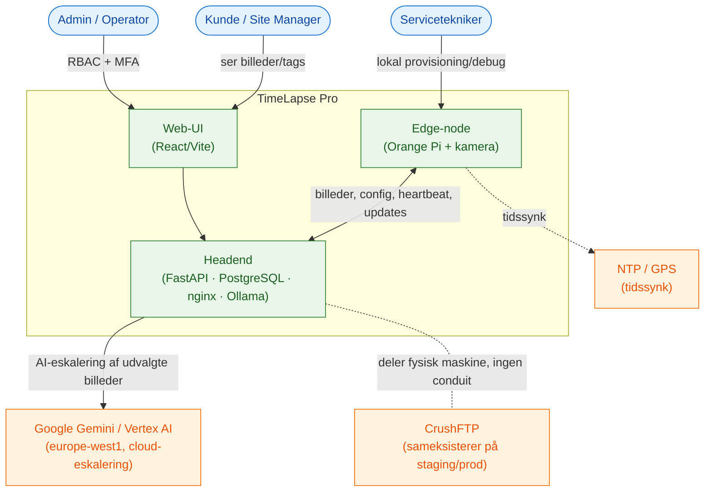
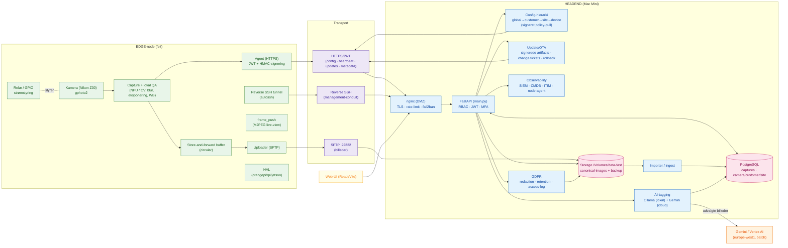
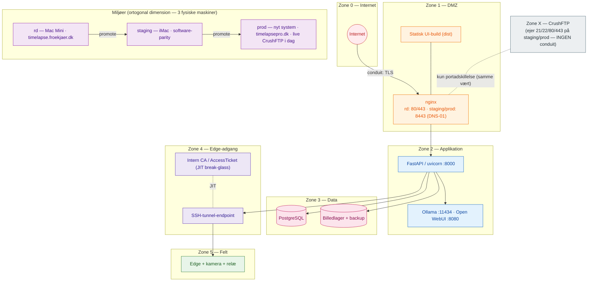
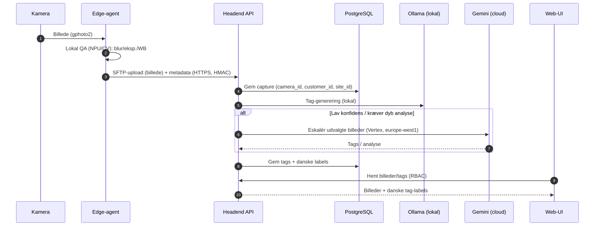
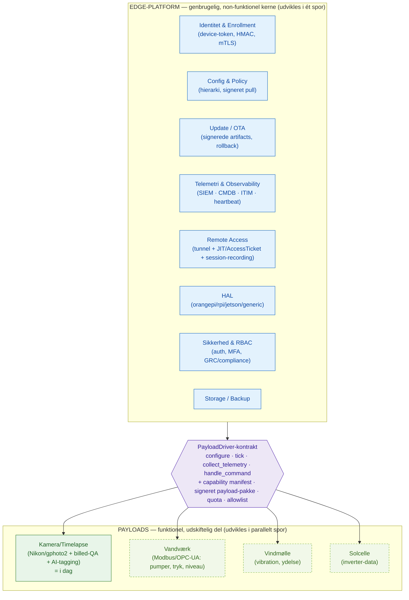

# TimeLapse Pro — Arkitektur & Dataflow (Mermaid)

**Dato:** 2026-07-15 · **Forfatter:** Claude (Cowork) · Renderes direkte på GitHub.
Diagrammerne beskriver (1) systemkontekst, (2) dataflow/komponenter, (3) IEC 62443-zoner & miljøer, (4) capture→tag-sekvens og (5) målbilledet: modulær platform/payload. Ret dem sammen med koden — de er versionsstyrede.

> Åbn samme indhold interaktivt i **draw.io/diagrams.net** via `TimeLapse_Arkitektur.drawio` i denne mappe.

---

## 1. Systemkontekst (hvem/hvad taler med systemet)

---

## 2. Dataflow & komponenter (det centrale diagram)

---

## 3. IEC 62443-zoner & miljøer (deployment)

---

## 4. Sekvens: capture → upload → AI-tag → UI

---

## 5. Målbillede: modulær platform + udskiftelig payload

*De stiplede payloads (vandværk/vind/sol) er fremtidige verticals. Pointen: alt i den blå platformkasse genbruges uændret — kun den grønne payload udskiftes.*
