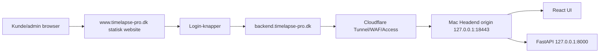

# Codex - Port-audit og website/backend-arkitektur

**Forfatter:** Codex  
**Dato:** 2026-06-23  
**Scope:** Mac Mini Headend, kommende `www.timelapse-pro.dk` og `backend.timelapse-pro.dk`.

## 1. Konklusion

TimeLapse Pro opfylder ikke den oenskede produktionsregel endnu, fordi lab-Headend aktuelt bruger nginx paa public `*:80` og `*:443`.

Codex-anbefaling:

- `www.timelapse-pro.dk` hostes som statisk public website uden for Headend-origin.
- Kunde/admin login redirecter til `https://backend.timelapse-pro.dk/login`.
- `backend.timelapse-pro.dk` gaar via Cloudflare Tunnel eller tilsvarende.
- Mac Headend-origin lytter kun paa loopback/non-standard port, fx `127.0.0.1:18443`.
- TimeLapse Pro maa ikke kraeve inbound TCP `80`, `443`, `21`, `22` eller `8080` paa Mac Headend.

## 2. Aktuel port-evidens

Seneste lokale `lsof` viste relevante lyttere:

| Port | Binding | Proces | Relation | Vurdering |
|---:|---|---|---|---|
| 80 | `*` | nginx | TimeLapse lab redirect | Ikke prod-kompliant |
| 443 | `*` | nginx | TimeLapse lab UI/API | Ikke prod-kompliant |
| 8000 | `127.0.0.1` | python/uvicorn | Headend API | OK intern |
| 11434 | `127.0.0.1` | ollama | Lokal AI | OK intern |
| 5432 | loopback | PostgreSQL | Database | OK intern |
| 5514 | `127.0.0.1` | Python syslog | SIEM/lab | OK intern |
| 2201/2202 | `*` | sshd-session | Reverse SSH/lab | Skal klassificeres |
| 5000/7000 | `*` | macOS ControlCenter | Fremmed/co-resident | Ikke TimeLapse |
| 21 | ikke aktivt | - | FTP | Maa ikke bruges |
| 22 | set i aeldre evidens | macOS SSH | Platform/admin | Ikke TimeLapse SFTP |
| 8080 | ikke public i seneste lsof | OpenWebUI hvis aktiv | Lab/tooling | Maa ikke public |

## 3. Produktionsregler for forbudte porte

| Port | Codex-regel |
|---:|---|
| 80 | Maa ejes af Cloudflare/public website/proxy, ikke Mac Headend-origin for TimeLapse backend |
| 443 | Maa ejes af Cloudflare/public website/proxy, ikke Mac Headend-origin for TimeLapse backend |
| 21 | Maa ikke bruges |
| 22 | Maa ikke bruges til TimeLapse SFTP eller normal TimeLapse drift |
| 8080 | Maa ikke eksponeres public; OpenWebUI skal vaere loopback/lab eller RBAC-beskyttet intern service |

## 4. Target portprofil

| Funktion | Target | Binding |
|---|---:|---|
| Backend origin HTTPS | 18443 | `127.0.0.1` |
| Backend origin HTTP, hvis TLS termineres eksternt | 18080 | `127.0.0.1` |
| FastAPI intern | 8000 eller 18000 | `127.0.0.1` |
| OpenWebUI intern | 18081 | `127.0.0.1` |
| SFTP ingress | 12222 | privat interface/tunnel |
| SIEM/syslog | 15514 | loopback/privat |
| Ollama | 11434 | `127.0.0.1` |

## 5. Website/backend-arkitektur

## 6. Public website

Codex har oprettet en statisk hjemmeside i:

- `website/index.html`
- `website/styles.css`
- `website/script.js`
- `website/assets/`

Den kan hostes paa Cloudflare Pages eller tilsvarende og skal ikke koere paa Headend.

Login-links:

- Kunde: `https://backend.timelapse-pro.dk/login`
- Admin: `https://backend.timelapse-pro.dk/login?role=admin`

## 7. Migrationsplan

1. Opret `backend.timelapse-pro.dk` i DNS/Cloudflare.
2. Opsaet Cloudflare Tunnel fra Mac Headend.
3. Tilfoej ny nginx listener paa `127.0.0.1:18443`.
4. Test lokalt: `curl -k https://127.0.0.1:18443/api/health`.
5. Test gennem Cloudflare: `curl https://backend.timelapse-pro.dk/api/health`.
6. Opdater Headend `base_url`.
7. Opdater Edge bootstrap/config policy til backend-hostname.
8. Flyt OpenWebUI til `127.0.0.1:18081` eller marker lab-only.
9. Flyt SFTP fra lab-port til godkendt non-standard prod-port, anbefalet `12222`.
10. Fjern TimeLapse nginx-listeners paa `*:80` og `*:443`.
11. Gem portaudit som GRC-evidence.

## 8. Go-live portkrav

Foer production:

- `lsof` maa ikke vise TimeLapse-origin paa `*:80`, `*:443`, `*:21`, `*:22`, `*:8080`.
- `www.timelapse-pro.dk` skal vaere adskilt fra backend.
- `backend.timelapse-pro.dk/api/health` skal svare `200`.
- `backend.timelapse-pro.dk/api/cmdb/` skal svare `401` uden login.
- Rollback-plan for Cloudflare route skal findes.

