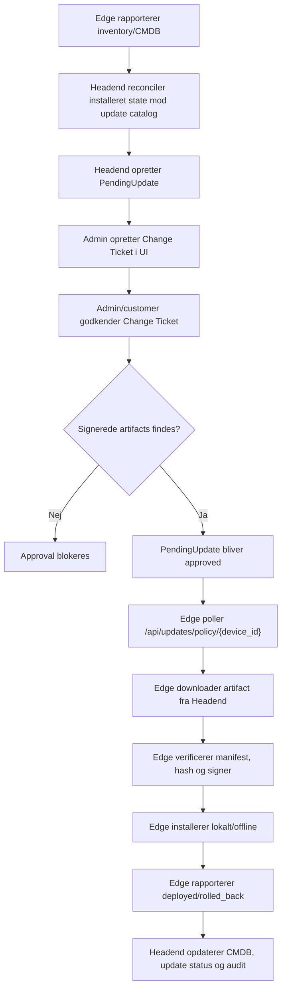

# TimeLapse Pro - Update approval og deployment-flow

Dato: 2026-06-05
Scope: Headend-styret update-flow for Edge-enheder uden krav om direkte Internet-adgang.

Styrende release-metodik:

- `Dokumentation/Release_Promotion_Methodology_2026-06-05.md`

## Konklusion 2026-06-05

De to OS patch-pakker, der lå klar til Edge, er ikke installeret.

Aktuel DB-status:

| ID | Type | Version | Miljo | Status | Resultat |
|---:|---|---|---|---|---|
| 12 | os_security | 49 pakker | test | rolled_back | Ikke deployed |
| 11 | os_updates | 39 pakker | test | rolled_back | Ikke deployed |

Rodarsag:

- Headend/UI kan godkende en `PendingUpdate`.
- Edge-koden havde en forkert OS-installationsvej, der kaldte `sudo apt-get upgrade`.
- Edge skal ikke bruge direkte apt/Internet i produktion. OS updates skal hentes som Headend-signerede offline artifacts.
- Den aktuelle Edge har heller ikke passwordless sudo til apt, sa den gamle vej ville fejle selv i lab.

Der er nu lagt en kode-aendring i repoet, sa:

- Edge afviser OS updates uden Headend-signeret offline artifact.
- Headend blokerer approval af OS/app updates uden bundet artifact.
- Fejlen bliver dermed synlig i approval-flowet i stedet for at ende som uklar rollback pa Edge.

Bemark: Headend-servicen skal genstartes for at aktivere Headend-kontrollen. Edge-koden skal ud via Timelapse Pro artifact-release, fordi live Edge-filer under `/opt/timelapse` er root-ejede.

## Arkitekturprincip

Edge maa ikke vaere update authority.

Edge rapporterer installeret tilstand og haenter kun godkendte, signerede artifacts fra Headend. Headend beregner missing updates, styrer approval, holder update-katalog og artifacts, og opdaterer CMDB.

Edge maa ikke kraeve:

- direkte Internet
- direkte GitHub
- `apt-get upgrade` mod eksterne repositories
- manuel SSH som normal deployment-kanal

## Korrekt flow



## Hvor godkender man?

Der er to UI-veje:

1. **Opdateringer**
   - URL: `/updates`
   - Viser `pending_updates`
   - Kan godkende, afvise, promote og rollback.
   - Direkte approval er praktisk i lab, men bor i produktion kraeve artifact og change ticket.

2. **Change tickets**
   - URL: `/change-tickets`
   - Opret ticket fra `PendingUpdate ID`.
   - Godkend/afvis ticket med audit-note.
   - Ticket indeholder hash-binding, artifact-reference, risk, rollback-plan og vedligeholdelsesvindue.

Anbefalet produktionsvej:

1. Reconcile opretter `PendingUpdate`.
2. Admin opretter Change Ticket fra update.
3. Artifact skal vaere oprettet og signeret i Headend.
4. Ticket godkendes.
5. Headend frigiver update til Edge policy.
6. Edge puller og deployer.

## API-endpoints

Operator/admin UI bruger:

- `GET /api/updates/pending`
- `POST /api/updates/{update_id}/change-ticket`
- `GET /api/change-tickets`
- `GET /api/change-tickets/{ticket_id}`
- `POST /api/change-tickets/{ticket_id}/approve`
- `POST /api/change-tickets/{ticket_id}/reject`
- `POST /api/updates/{update_id}/approve`
- `POST /api/updates/{update_id}/reject`
- `POST /api/updates/{update_id}/force-rollback`

Edge bruger:

- `GET /api/updates/policy/{device_id}`
- `GET /api/updates/artifacts/{artifact_id}/files/{file_path}`
- `POST /api/updates/report`

## Status for UI

UI findes og er delvist brugbar:

- `/updates` viser pending/approved/deployed/rejected/rolled_back.
- `/updates` sender approval payload med `environment`, `scope` og `scope_id`.
- `/change-tickets` kan oprette, vise og godkende/afvise tickets.
- `/updates` har artifact-katalog for Timelapse Pro app artifacts.

Mangler for fuldt produktionsflow:

- UI-knap til Headend reconcile fra CMDB/update catalog.
- UI for OS artifact catalog: hvilke `.deb` pakker, hashes, versionsspring, repo source og reboot flag.
- Obligatorisk change-ticket-gate for production approval.
- Per-target status skal opdateres fra Edge reports; `update_targets` findes, men status bliver ikke konsekvent opdateret.
- OS offline artifact-installation mangler pa Edge. Den gamle apt-vej er blokeret i repoet.

## Test udført 2026-06-05

Headend/DB:

- `pending_updates` viser `id=11` og `id=12` som `rolled_back`.
- Begge har `deployed_count=0`.
- Der findes ingen `update_targets` for `id=11`/`id=12`.

Edge:

- `timelapse-edge` er aktiv.
- Edge kan kontakte Headend igen efter nginx-fixen.
- `orangepi` har ikke passwordless sudo til apt:
  - `sudo -n true` fejler.
  - `sudo -n apt-get ...` fejler.
- Det bekraefter, at den gamle OS-update path ikke kan vaere produktionsflow.

Kodeverifikation:

- `edge/agent.py`, `headend/main.py` og `headend/tools/reconcile_updates.py` compiler med separat pycache.

UI-test:

- In-app browser var ikke tilgaengelig i Codex-sessionen.
- UI-koden er gennemgaet statisk, og endpoints er verificeret fra backend.
- Live UI kan vise flowet, men Headend-servicen skal genstartes for den nye artifact-gate.

## Implementeret OS offline artifact-flow 2026-06-08

Edge OS updates skal nu koere som Headend-styret offline bundle:

1. Edge rapporterer kun installeret-state til CMDB (`device_inventory.os_packages`).
2. Headend sammenligner CMDB installeret-state med et LAB-testet update-katalog fra mirror/artifact pipeline.
3. Headend genererer en OS update plan/bundle request med de pakker, der mangler.
4. Lab host bygger et bundle fra Headend-planen med:
   - `packages/*.deb`
   - `package-manifest.json`
   - `install-offline.sh`
   - `verify-installed.sh`
   - `bundle-summary.json`
5. Bundle kopieres til Headend.
6. Admin registrerer bundlet i UI under `Opdateringer -> Signeret artifact-katalog -> OS bundle`.
7. Headend validerer at bundlet indeholder manifest, verify-script og `.deb` filer.
8. Headend signerer artifact-manifestet.
9. Admin binder artifact-id til den blokerede Edge update.
10. Update kommer tilbage i `Afventer`.
11. Admin/customer godkender update.
12. Edge poller Headend, verificerer signer/hash/trust, henter artifact-filer fra Headend, tager pre-update backup og installerer offline.
13. Edge rapporterer `deployed` eller `blocked` med device-id og reason.
14. Headend opdaterer `pending_updates` og `update_targets`.

## Flow-status i UI

`Opdateringer` viser nu to niveauer af status:

- Overordnet update-status: `pending`, `approved`, `blocked`, `deployed`, `rolled_back`.
- Per-target Edge-status fra `update_targets`: `queued`, `downloading`, `verifying`, `backing_up`, `installing`, `deployed`, `failed`.

Nar en update ekspanderes i UI, skal operatoeren kunne se:

- om Headend venter pa lab bundle/artifact
- om update er godkendt og klar til Edge pull
- hvilken Edge der er target
- sidste heartbeat/`last_seen`
- sidste update-rapport fra Edge
- om Edge venter pa policy-pull/heartbeat, downloader, verifierer, tager backup eller installerer
- seneste fejlarsag hvis Edge rapporterer `blocked`

Relevant API:

- `GET /api/updates/{update_id}/flow-status`
- `POST /api/updates/report`

Edge rapporterer mellemtrin til `update_targets`, uden at flytte selve `pending_updates.status` vaek fra `approved`. Slutstatusserne `deployed`, `rolled_back` og `blocked` opdaterer fortsat den overordnede update.

Lab build eksempel:

```bash
python3 headend/tools/build_os_bundle.py \
  --device-id TL-C87FF9587CA0 \
  --catalog /var/lib/timelapse/update-plans/TL-C87FF9587CA0-lab.json \
  --output /tmp/timelapse-os-security-2026-06-08 \
  --architecture arm64 \
  --source-ref ubuntu-security-2026-06-08 \
  --force
```

UI catalog eksempel:

- Bundle-sti pa Headend: `/tmp/timelapse-os-security-2026-06-08`
- Version: `edge-os-security-2026-06-08`
- Install commands JSON:

```json
[{"name":"offline dpkg install","argv":["/bin/bash","{bundle}/install-offline.sh"],"timeout_s":1800}]
```

Vigtige kontroller:

- Edge maa ikke koere `apt-get update`, `apt-get upgrade`, `dist-upgrade` eller `full-upgrade`.
- `apt-get` maa kun bruges med `--no-download` til lokal dependency fix efter `dpkg -i`.
- Artifact-download er begranset til Headend og til filer i det signerede manifest.
- Production Edge maa ikke hente direkte fra Internet, apt repositories, GitHub eller andre upstreams.
- Edge verificerer manifest SHA-256 og trusted release signer foer installation.
- Manglende/utroværdig artifact rapporteres som `blocked`, ikke `rolled_back`.

## Naeste tekniske opgaver

1. Gør UI production-safe:
   - Reconcile-knap.
   - Artifact-required indikator.
   - Disable approval hvis artifact mangler.
   - Obligatorisk Change Ticket for production.
   - Per-device deployment matrix baseret pa `update_targets`.

2. Ret live drift:
   - Genstart Headend efter patch.
   - Udrul Edge-patch via Timelapse Pro app artifact.
   - Opret nye OS artifacts for de 49 security og 39 functional packages.
