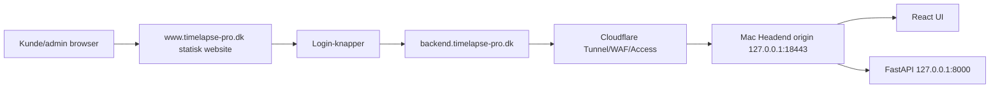

# TimeLapse Pro — Portaudit, migrationsplan og website-arkitektur (v10, konsolideret)

**Version:** 10 (konsolideret)
**Dato:** 2026-07-02
**Relaterede dokumenter:** Mac_Headend_Asset_Port_Register_2026-06-05.md, Mac_Headend_Port_Migration_Plan_2026-06-05.md
**Konsoliderer:** `PORT_AUDIT_og_WEBSITE_2026-06-23.md`, `Claude_PORT_AUDIT_og_WEBSITE_2026-06-23.md`, `Codex_PORT_AUDIT_og_WEBSITE_2026-06-23.md` (arkiveret i `Gamle versioner/`).

---

## 1. Formål

Dette dokument:
1. Verificerer hvilke porte TimeLapse Pro bruger i dag
2. Dokumenterer brug af forbudte porte (80, 443, 21, 22)
3. Definerer migrationsplan til non-standard porte
4. Beskriver www.timelapse-pro.dk website-arkitektur med kunde/admin-login

---

## 2. Aktuel portanvendelse (verificeret 2026-06-23)

### 2.1 TimeLapse Pro-ejede porte

| Port | Protokol | Binding | Service | Ejer | Forbudt? |
|---|---|---|---|---|---|
| **80** | TCP | `*` | nginx HTTP redirect | TLP-managed | ⚠️ JA |
| **443** | TCP | `*` | nginx HTTPS public | TLP-managed | ⚠️ JA |
| **8000** | TCP | `127.0.0.1` | FastAPI/uvicorn Headend API | TLP-managed | ✅ Intern |
| **22222** | TCP | `*` | SFTP ingress (edge upload) | TLP-managed | 🟡 Se note |

### 2.2 Platform- og systemporte

| Port | Protokol | Binding | Service | Ejer | Handling |
|---|---|---|---|---|---|
| **22** | TCP | `*` | macOS SSH | Host/platform | ⚠️ Ikke eksponeret mod internet |
| **5432** | TCP | `127.0.0.1` | PostgreSQL | TLP-platform | ✅ OK |
| **11434** | TCP | `127.0.0.1` | Ollama | TLP-platform | ✅ OK |
| **8080** | TCP | `127.0.0.1` | OpenWebUI | TLP-platform | 🟡 Nede |
| **5900** | TCP | `*` | macOS VNC/Screen Sharing | Host/platform | 🟠 Ikke eksponeret |
| **5514** | TCP | `127.0.0.1` | SIEM/syslog receiver | TLP-managed | ✅ OK |

### 2.3 Tidligere uklassificerede porte

| Port | Status | Handling |
|---|---|---|
| 2201 | Klassificeret 2026-07-05: `sshd-session`, TimeLapse reverse SSH lab/support-forward til edge | Kun tilladt som eksplicit support-/lab-tunnel; i prod bag Cloudflare Access/firewall eller lukket når ikke aktiv |
| 5000 | Klassificeret 2026-07-05: macOS `ControlCenter`, Apple AirPlay/Control Center-familie, ikke TimeLapse | Disable AirPlay Receiver/relateret deling eller blokér med Mac/pf firewall før Internet-facing prod |
| 7000 | Klassificeret 2026-07-05: macOS `ControlCenter`, Apple AirPlay/Control Center-familie, ikke TimeLapse | Disable AirPlay Receiver/relateret deling eller blokér med Mac/pf firewall før Internet-facing prod |
| 3283 | Apple Remote Desktop? | Bekræft og beslut |

---

## 3. Forbudte porte — vurdering

### Port 80
**I dag:** nginx binder til `*:80` for ACME-challenge og HTTPS-redirect. Ingen data i plaintext.
**Problem:** Co-residence-risiko. CrushFTP eller anden software kan have behov for port 80.
**Løsning:** Cloudflare Tunnel overtager public 80/443. nginx flyttes til `127.0.0.1:18443`.

### Port 443
**I dag:** ⚠️ Bruges aktivt til public UI og API (`*:443`).
**Problem:** Binding til `*:443` risikerer konflikt med CrushFTP og andre services.
**Løsning:** Se port 80 — Cloudflare Tunnel.

### Port 21 (FTP)
**I dag:** ✅ Bruges IKKE af TimeLapse Pro. SFTP bruges i stedet.
**Verificering:** `lsof -i :21` på Headend bør returnere ingenting.

### Port 22 (SSH)
**I dag:** ⚠️ System-SSH kører på port 22. TimeLapse's sftp_*-brugere er blokeret via sshd Match-regler.
**Problem:** Admin-SSH bør ikke være direkte Internet-eksponeret.
**Løsning:** Cloudflare Access SSH som gateway, eller flyt til non-standard port.

---

## 4. Migrationsplan — Cloudflare Tunnel

### 4.1 Arkitektur

```
Internet
  ↓
Cloudflare (edge) — håndterer TLS, DDoS, WAF
  ↓ Cloudflare Tunnel (outbound fra Mac, ingen inbound firewall-åbning)
cloudflared daemon på Mac Mini
  ↓
nginx 127.0.0.1:18443
  ↓
uvicorn 127.0.0.1:8000
```

### 4.2 Ny portmodel

| Formål | Port | Binding | Erstatter |
|---|---:|---|---|
| nginx TLS origin | 18443 | 127.0.0.1 | 443 (public) |
| Headend API | 8000 | 127.0.0.1 | uændret |
| SFTP ingress | 12222 | LAN-IP | 22222 |
| OpenWebUI | 8080 | 127.0.0.1 | uændret |
| PostgreSQL | 5432 | 127.0.0.1 | uændret |
| Ollama | 11434 | 127.0.0.1 | uændret |

**Port 80 og 443 ejes ikke af TimeLapse Pro efter migration.**

### 4.3 Migrationstrin

```bash
# 1. Installer cloudflared
brew install cloudflare/cloudflare/cloudflared

# 2. Log ind og opret tunnel
cloudflared tunnel login
cloudflared tunnel create timelapse-headend

# 3. Konfigurer ~/.cloudflared/config.yml
cat > ~/.cloudflared/config.yml << 'EOF'
tunnel: <tunnel-id>
credentials-file: /Users/peter/.cloudflared/<tunnel-id>.json
ingress:
  - hostname: timelapse-pro.dk
    service: https://127.0.0.1:18443
    originRequest:
      noTLSVerify: true
  - hostname: www.timelapse-pro.dk
    service: https://127.0.0.1:18443
    originRequest:
      noTLSVerify: true
  - hostname: backend.timelapse-pro.dk
    service: https://127.0.0.1:18443
    originRequest:
      noTLSVerify: true
  - service: http_status:404
EOF

# 4. Tilføj nginx listener på 18443 (hold 80/443 midlertidigt)
# Tilføj i nginx.conf:
#   server { listen 127.0.0.1:18443 ssl; server_name timelapse-pro.dk ...; }

# 5. Test lokalt
curl -sk https://127.0.0.1:18443/api/health

# 6. Start tunnel og test udefra
cloudflared tunnel run timelapse-headend
curl https://timelapse-pro.dk/api/health

# 7. Installer som LaunchAgent
cloudflared service install

# 8. Fjern TimeLapse nginx fra *:80 og *:443 (efter Tunnel er bekræftet)
```

### 4.4 Cloudflare DNS

```
Type   Navn                        Indhold                        Proxy
CNAME  timelapse-pro.dk            <tunnel-id>.cfargotunnel.com   ✅
CNAME  www.timelapse-pro.dk        <tunnel-id>.cfargotunnel.com   ✅
CNAME  backend.timelapse-pro.dk    <tunnel-id>.cfargotunnel.com   ✅
```

---

## 5. www.timelapse-pro.dk — website-arkitektur

### 5.1 URL-struktur

```
www.timelapse-pro.dk          ← Marketing/info-side (statisk)
├── /                         ← Forside
├── /features                 ← Funktioner
├── /pricing                  ← Priser
├── /contact                  ← Kontakt
├── /login                    ← Login-portal med redirect
└── /privacy                  ← GDPR-oplysninger

backend.timelapse-pro.dk      ← Headend (React SPA + FastAPI)
├── /                         ← React login-side
├── /gallery                  ← Billedgalleri (kræver login)
├── /search                   ← Tag-søgning
├── /admin/*                  ← Admin UI
└── /api/*                    ← FastAPI endpoints
```

### 5.2 Login-flow

```
Bruger: www.timelapse-pro.dk/login
  ↓
Klik "Kundelogin" eller "Administratorlogin"
  ↓
Redirect: https://backend.timelapse-pro.dk/
  ↓
React: loginformular → POST /api/auth/login
  ↓
JWT-cookie sat
  ↓
Redirect: /gallery (viewer/operator) eller /admin (admin/super_admin)
```

> Kunde og admin bruger **samme URL** (`backend.timelapse-pro.dk`) — RBAC styrer adgangen.

### 5.3 Marketing-side (www.timelapse-pro.dk)

Anbefales som Cloudflare Pages (statisk, ingen server). Indhold:

**Forside:**
- Headline: "Professionel dokumentation af din byggeplads"
- Key features: automatiske billeder, AI-analyse, sikker cloud-opbevaring, GDPR-compliant
- CTA-knapper:

```html
<a href="https://backend.timelapse-pro.dk/">Kundelogin</a>
<a href="https://backend.timelapse-pro.dk/">Administratorlogin</a>
```

**Privacy-side:** GDPR-oplysninger, databehandler, retention, subprocessorer (Google Cloud/Gemini).

### 5.4 nginx-konfiguration

```nginx
# www.timelapse-pro.dk — statisk marketing
server {
    listen 127.0.0.1:18443 ssl;
    server_name www.timelapse-pro.dk timelapse-pro.dk;
    ssl_certificate     /path/to/fullchain.pem;
    ssl_certificate_key /path/to/privkey.pem;
    root /opt/timelapse-www/dist;
    index index.html;
    location / { try_files $uri $uri/ /index.html; }
}

# backend.timelapse-pro.dk — React SPA + API
server {
    listen 127.0.0.1:18443 ssl;
    server_name backend.timelapse-pro.dk;
    ssl_certificate     /path/to/fullchain.pem;
    ssl_certificate_key /path/to/privkey.pem;
    add_header Strict-Transport-Security "max-age=31536000; includeSubDomains" always;

    root /Users/peter/projects/timelapse-pro/timelapse-ui/dist;
    index index.html;
    location / { try_files $uri $uri/ /index.html; }

    location ~ ^/api/auth/login {
        limit_req zone=api_login burst=5 nodelay;
        proxy_pass http://127.0.0.1:8000;
        proxy_set_header Host $host;
        proxy_set_header X-Real-IP $remote_addr;
        proxy_set_header X-Forwarded-For $proxy_add_x_forwarded_for;
        proxy_set_header X-Forwarded-Proto https;
        proxy_pass_header Set-Cookie;
        proxy_set_header Cookie $http_cookie;
    }

    location /api/ {
        limit_req zone=api_general burst=60 nodelay;
        proxy_pass http://127.0.0.1:8000;
        proxy_set_header Host $host;
        proxy_set_header X-Real-IP $remote_addr;
        proxy_set_header X-Forwarded-For $proxy_add_x_forwarded_for;
        proxy_set_header X-Forwarded-Proto https;
        proxy_pass_header Set-Cookie;
        proxy_set_header Cookie $http_cookie;
    }
}
```

---

## 6. Verificeringstest

```bash
# Portaudit — ingen public 80/443 fra TimeLapse
lsof -i -n -P | grep LISTEN

# Forbudte porte
for port in 21 80 443; do
  echo -n "Port $port (TimeLapse): "
  lsof -i :$port -n -P | grep -i "nginx\|uvicorn\|timelapse" || echo "OK — ingen"
done

# Forventet tilstand efter migration
# Port 21:    INGEN
# Port 80:    INGEN fra TimeLapse
# Port 443:   INGEN fra TimeLapse
# Port 8000:  uvicorn 127.0.0.1
# Port 12222: sshd SFTP
# Port 18443: nginx 127.0.0.1

# Funktionel test
curl https://www.timelapse-pro.dk/           # 200 OK
curl https://backend.timelapse-pro.dk/api/health  # 200 application/json
curl https://backend.timelapse-pro.dk/api/cmdb/   # 401
```

---

## 7. Åbne beslutninger

| Beslutning | Muligheder | Anbefaling |
|---|---|---|
| www-teknologi | Statisk HTML, Next.js, Cloudflare Pages | Cloudflare Pages |
| timelapse.froekjaer.dk efter skift | Behold, redirect 301, fjern | Redirect → timelapse-pro.dk |
| SFTP-port (22222→12222) | Skift nu eller ved næste edge | Næste edge-deployment |
| CrushFTP placering | Bliv på Mac, flyt, bag proxy | Afklar ejerskab inden go-live |
| Admin-SSH | Port 22 + Cloudflare Access, flyt port | Cloudflare Access SSH |

---

## 8. Codex-supplement — udvidet target-portprofil og website-filer

### 8.1 Udvidet target-portprofil (Codex)

| Funktion | Target | Binding |
|---|---:|---|
| Backend origin HTTPS | 18443 | `127.0.0.1` |
| Backend origin HTTP (hvis TLS termineres eksternt) | 18080 | `127.0.0.1` |
| FastAPI intern | 8000 eller 18000 | `127.0.0.1` |
| OpenWebUI intern | 18081 | `127.0.0.1` |
| SFTP ingress | 12222 | privat interface/tunnel |
| SIEM/syslog | 15514 | loopback/privat |
| Ollama | 11434 | `127.0.0.1` |

### 8.2 Website/backend-arkitektur (Codex mermaid)



### 8.3 Public website-filer (allerede oprettet af Codex)

Statisk site ligger i `website/` (`index.html`, `styles.css`, `script.js`, `assets/`) og hostes på Cloudflare Pages e.l. — ikke på Headend. Login-links:
- Kunde: `https://backend.timelapse-pro.dk/login`
- Admin: `https://backend.timelapse-pro.dk/login?role=admin`

### 8.4 Ekstra migrationstrin (Codex)

Ud over trin i §4.3: efter ny nginx-listener testet lokalt og gennem Cloudflare — (6) opdater Headend `base_url`, (7) opdater Edge bootstrap/config-policy til backend-hostname, (8) flyt OpenWebUI til `127.0.0.1:18081` eller marker lab-only, (9) gem portaudit som GRC-evidence.

---

*Se også: GO_LIVE_CHECKLIST_v10.md, Mac_Headend_Port_Migration_Plan_2026-06-05.md*
