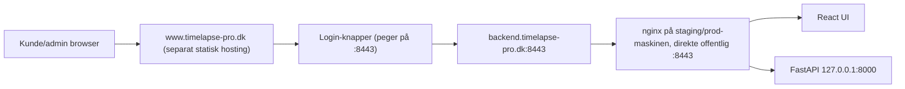

# TimeLapse Pro — Portaudit, migrationsplan og website-arkitektur (v10, konsolideret)

**Version:** 10 (konsolideret)
**Dato:** 2026-07-02
**Relaterede dokumenter:** Mac_Headend_Asset_Port_Register_2026-06-05.md, Mac_Headend_Port_Migration_Plan_2026-06-05.md
**Konsoliderer:** `PORT_AUDIT_og_WEBSITE_2026-06-23.md`, `Claude_PORT_AUDIT_og_WEBSITE_2026-06-23.md`, `Codex_PORT_AUDIT_og_WEBSITE_2026-06-23.md` (arkiveret i `Gamle versioner/`).

---

## 1. Formål

Dette dokument:
1. Verificerer hvilke porte TimeLapse Pro bruger i dag
2. Dokumenterer brug af forbudte porte (80, 443, 21, 22)
3. Definerer migrationsplan til non-standard porte
4. Beskriver www.timelapse-pro.dk website-arkitektur med kunde/admin-login

---

## 2. Aktuel portanvendelse (verificeret 2026-06-23)

### 2.1 TimeLapse Pro-ejede porte

| Port | Protokol | Binding | Service | Ejer | Forbudt? |
|---|---|---|---|---|---|
| **80** | TCP | `*` | nginx HTTP redirect | TLP-managed | ⚠️ JA |
| **443** | TCP | `*` | nginx HTTPS public | TLP-managed | ⚠️ JA |
| **8000** | TCP | `127.0.0.1` | FastAPI/uvicorn Headend API | TLP-managed | ✅ Intern |
| **22222** | TCP | `*` | SFTP ingress (edge upload) | TLP-managed | 🟡 Se note |

### 2.2 Platform- og systemporte

| Port | Protokol | Binding | Service | Ejer | Handling |
|---|---|---|---|---|---|
| **22** | TCP | `*` | macOS SSH | Host/platform | ⚠️ Ikke eksponeret mod internet |
| **5432** | TCP | `127.0.0.1` | PostgreSQL | TLP-platform | ✅ OK |
| **11434** | TCP | `127.0.0.1` | Ollama | TLP-platform | ✅ OK |
| **8080** | TCP | `127.0.0.1` | OpenWebUI | TLP-platform | 🟡 Nede |
| **5900** | TCP | `*` | macOS VNC/Screen Sharing | Host/platform | 🟠 Ikke eksponeret |
| **5514** | TCP | `127.0.0.1` | SIEM/syslog receiver | TLP-managed | ✅ OK |

### 2.3 Tidligere uklassificerede porte

| Port | Status | Handling |
|---|---|---|
| 2201 | Klassificeret 2026-07-05: `sshd-session`, TimeLapse reverse SSH lab/support-forward til edge | Kun tilladt som eksplicit support-/lab-tunnel; i prod bag Cloudflare Access/firewall eller lukket når ikke aktiv |
| 5000 | Klassificeret 2026-07-05: macOS `ControlCenter`, Apple AirPlay/Control Center-familie, ikke TimeLapse | Disable AirPlay Receiver/relateret deling eller blokér med Mac/pf firewall før Internet-facing prod |
| 7000 | Klassificeret 2026-07-05: macOS `ControlCenter`, Apple AirPlay/Control Center-familie, ikke TimeLapse | Disable AirPlay Receiver/relateret deling eller blokér med Mac/pf firewall før Internet-facing prod |
| 3283 | Apple Remote Desktop? | Bekræft og beslut |

---

## 3. Forbudte porte — vurdering

**KORREKTION 2026-07-05 (Claude, efter Peters bekræftelse):** Co-residence-risikoen nedenfor er
IKKE længere hypotetisk — Peter har bekræftet at **CrushFTP allerede kører på både
staging-iMac'en og prod-Mac Mini'en** og reelt optager 21, 22, 80 og 443 på begge disse maskiner.
Den tidligere planlagte løsning ("Cloudflare Tunnel overtager 80/443") er **droppet efter Peters
eksplicitte ønske om at undgå Cloudflare Tunnel** (bekræftet flere gange, senest 2026-07-05: "vi
anvender ikke Cloudflare tunnel til frontend"). Den nye, aftalte løsning er §4 nedenfor — direkte
eksponering på en ikke-standard port (8443), Let's Encrypt-certifikater via DNS-01 (ingen
portafhængighed), og marketingsitet (`www.timelapse-pro.dk`) hostet et andet sted end
CrushFTP-maskinerne.

### Port 80
**I dag (rd):** nginx binder til `*:80` for ACME-challenge og HTTPS-redirect. Ingen data i plaintext.
**Staging/prod:** Ejes af CrushFTP — TimeLapse Pro må IKKE binde hertil på disse maskiner.
**Løsning:** TimeLapse Pro-backend flytter til port 8443 (se §4). Ingen ACME-HTTP-01-udfordring
nødvendig (DNS-01 i stedet), så port 80 er slet ikke en afhængighed længere.

### Port 443
**I dag (rd):** ⚠️ Bruges aktivt til public UI og API (`*:443`).
**Staging/prod:** Ejes af CrushFTP — TimeLapse Pro må IKKE binde hertil på disse maskiner.
**Løsning:** Se port 80 — port 8443 i stedet, direkte eksponeret (ikke via Cloudflare Tunnel).

### Port 21 (FTP)
**I dag:** ✅ Bruges IKKE af TimeLapse Pro. SFTP bruges i stedet. På staging/prod er porten desuden
optaget af CrushFTP — endnu en grund til at TimeLapse Pro aldrig må antage den er ledig.
**Verificering:** `lsof -i :21` på Headend bør returnere ingenting fra TimeLapse-processer.

### Port 22 (SSH)
**I dag (rd):** ⚠️ System-SSH kører på port 22. TimeLapse's sftp_*-brugere er blokeret via sshd Match-regler.
**Staging/prod:** Kan også være optaget af CrushFTP (SFTP-tjeneste) — bekræft med `lsof` pr. maskine
før nogen TimeLapse-tjeneste antages at kunne bruge porten.
**Problem:** Admin-SSH bør ikke være direkte Internet-eksponeret.
**Løsning:** IP-allowlist/VPN eller ikke-standard admin-SSH-port. (Cloudflare Access som SSH-gateway
er stadig en mulighed, men Tunnel-produktet indgår ikke i den besluttede prod-arkitektur.)

---

## 4. Migrationsplan — direkte eksponering på port 8443 (IKKE Cloudflare Tunnel)

**Besluttet 2026-07-05 (Peter).** Erstatter den tidligere Cloudflare Tunnel-baserede plan
fuldstændigt, for BÅDE staging og prod (begge maskiner deler CrushFTP-portkonflikten).

### 4.1 Arkitektur

```
Internet
  ↓
DNS: backend.timelapse-pro.dk → maskinens offentlige IP (direkte A/AAAA-opslag,
     evt. Cloudflare "orange cloud" DNS-proxy — se note nedenfor — men IKKE Tunnel)
  ↓
nginx :8443 (bundet direkte til den offentlige adresse, ikke kun loopback —
     der er intet lag foran der terminerer TLS for os længere)
  ↓
uvicorn 127.0.0.1:8000
```

**Note om Cloudflare-proxy (valgfrit, adskilt fra Tunnel-spørgsmålet):** Cloudflares almindelige
DNS-proxy ("orange cloud", IKKE Tunnel-produktet) understøtter officielt port 8443 til HTTPS
(bekræftet via Cloudflares egen dokumentation, juli 2026 — se kildeliste i
`INSTALLATION_GUIDE_HEADEND_v1.md`). Caching er slået fra på denne port som standard, hvilket er
fint/ønsket for en applikations-backend. Peter kan altså vælge SENERE at lægge Cloudflares
gratis WAF/DDoS-beskyttelse foran port 8443 uden at det kræver Tunnel-produktet — det er en
uafhængig, valgfri beslutning, ikke noget der kræves for at 8443-arkitekturen virker.

### 4.2 Ny portmodel

| Formål | Port | Binding | Ejer |
|---|---:|---|---|
| Backend TLS origin (`backend.timelapse-pro.dk`) | **8443** | direkte offentlig adresse (ikke kun loopback) | TimeLapse Pro |
| Headend API | 8000 | 127.0.0.1 | TimeLapse Pro (internt) |
| SFTP ingress | 22222 (eller 12222, se §7) | offentlig | TimeLapse Pro |
| OpenWebUI | 8080 | 127.0.0.1 | TimeLapse Pro (internt) |
| PostgreSQL | 5432 | 127.0.0.1 | TimeLapse Pro (internt) |
| 21, 22, 80, 443 | — | — | **CrushFTP — TimeLapse Pro rører ALDRIG disse på staging/prod** |

**Marketingsitet (`www.timelapse-pro.dk`/`timelapse-pro.dk`) hostes IKKE på samme maskine som
CrushFTP/backend** — se §5.3 (opdateret) — og er derfor slet ikke en del af denne portmodel;
besøgende når det på almindelig `https://` uden portnummer, uanset hvad der foregår på
staging-/prod-maskinerne.

### 4.3 Migrationstrin (certifikat via DNS-01 — rører ALDRIG port 80/443)

```bash
# 0. Bekræft porten reelt er ledig på DENNE maskine, før noget andet:
sudo lsof -iTCP -sTCP:LISTEN -P -n | grep 8443   # bør returnere ingenting

# 1. Installér certbot + Cloudflare DNS-plugin
brew install certbot
pip3 install certbot-dns-cloudflare   # eller: brew install certbot-dns-cloudflare hvis tilgængeligt

# 2. Opret en Cloudflare API-token med KUN "Zone:DNS:Edit"-rettighed for jeres zone
#    (Cloudflare dashboard → My Profile → API Tokens → Create Token) — gem den IKKE i Git.
sudo mkdir -p /etc/timelapse/certbot
sudo tee /etc/timelapse/certbot/cloudflare.ini > /dev/null <<'EOF'
dns_cloudflare_api_token = <indsæt jeres token her>
EOF
sudo chmod 600 /etc/timelapse/certbot/cloudflare.ini

# 3. Udsted certifikatet — INGEN port 80/443 involveret overhovedet
sudo certbot certonly \
  --dns-cloudflare \
  --dns-cloudflare-credentials /etc/timelapse/certbot/cloudflare.ini \
  -d backend.timelapse-pro.dk \
  --agree-tos --no-eff-email -m <din-email@domæne>

# 4. Link certifikatet til nginx' forventede sti (samme mønster som rd i dag)
sudo mkdir -p /opt/homebrew/etc/nginx/ssl/backend.timelapse-pro.dk
sudo ln -sf /etc/letsencrypt/live/backend.timelapse-pro.dk/fullchain.pem /opt/homebrew/etc/nginx/ssl/backend.timelapse-pro.dk/fullchain.pem
sudo ln -sf /etc/letsencrypt/live/backend.timelapse-pro.dk/privkey.pem  /opt/homebrew/etc/nginx/ssl/backend.timelapse-pro.dk/privkey.pem

# 5. nginx-config: listen 8443 ssl (IKKE 127.0.0.1 — skal nås direkte udefra)
# 6. sudo nginx -t && sudo nginx -s reload
# 7. Test udefra: curl https://backend.timelapse-pro.dk:8443/api/health
# 8. Auto-fornyelse: certbot renew --dry-run (samme DNS-01-plugin bruges automatisk igen)
```

### 4.4 DNS

```
Type  Navn                       Indhold                    Proxy
A     backend.timelapse-pro.dk   <maskinens offentlige IP>  ⬜ grå sky (direkte) ELLER
                                                             ✅ orange sky (Cloudflare-proxy,
                                                             8443 er understøttet — valgfrit)
```

Ingen `cfargotunnel.com`-CNAME, intet `cloudflared`, ingen Tunnel-credentials-fil.

---

## 5. www.timelapse-pro.dk — website-arkitektur

### 5.1 URL-struktur

```
www.timelapse-pro.dk          ← Marketing/info-side (statisk)
├── /                         ← Forside
├── /features                 ← Funktioner
├── /pricing                  ← Priser
├── /contact                  ← Kontakt
├── /login                    ← Login-portal med redirect
└── /privacy                  ← GDPR-oplysninger

backend.timelapse-pro.dk      ← Headend (React SPA + FastAPI)
├── /                         ← React login-side
├── /gallery                  ← Billedgalleri (kræver login)
├── /search                   ← Tag-søgning
├── /admin/*                  ← Admin UI
└── /api/*                    ← FastAPI endpoints
```

### 5.2 Login-flow

```
Bruger: www.timelapse-pro.dk/login
  ↓
Klik "Kundelogin" eller "Administratorlogin"
  ↓
Redirect: https://backend.timelapse-pro.dk:8443/
  ↓
React: loginformular → POST /api/auth/login
  ↓
JWT-cookie sat
  ↓
Redirect: /gallery (viewer/operator) eller /admin (admin/super_admin)
```

> Kunde og admin bruger **samme URL** (`backend.timelapse-pro.dk:8443`) — RBAC styrer adgangen.
> **Portnummeret er nødvendigt** fordi CrushFTP allerede ejer 80/443 på staging- og
> prod-maskinerne (§3/§4) — marketingsitet selv kører dog på almindelig `https://` uden
> portnummer, da det hostes et helt andet sted (§5.3).

### 5.3 Marketing-side (www.timelapse-pro.dk)

**Hostes IKKE på staging-/prod-maskinerne** (de kører CrushFTP + Headend) — anbefales som
separat statisk hosting, fx Cloudflare Pages (statisk, ingen server, ingen portkonflikt
overhovedet siden det ikke er den samme maskine). Indhold:

**Forside:**
- Headline: "Professionel dokumentation af din byggeplads"
- Key features: automatiske billeder, AI-analyse, sikker cloud-opbevaring, GDPR-compliant
- CTA-knapper (bemærk portnummeret — se §5.2):

```html
<a href="https://backend.timelapse-pro.dk:8443/">Kundelogin</a>
<a href="https://backend.timelapse-pro.dk:8443/">Administratorlogin</a>
```

**Privacy-side:** GDPR-oplysninger, databehandler, retention, subprocessorer (Google Cloud/Gemini).

### 5.4 nginx-konfiguration

**Kun ét vhost** kører på staging/prod-maskinen — marketingsitet er flyttet ud (§5.3), så der er
intet `www.timelapse-pro.dk`-serverblok her længere.

```nginx
# backend.timelapse-pro.dk — React SPA + API
# Bemærk: listen på selve den offentlige adresse, IKKE 127.0.0.1 — der er intet
# Cloudflare Tunnel/reverse-proxy-lag foran der terminerer TLS for os på denne maskine.
server {
    listen 8443 ssl;
    server_name backend.timelapse-pro.dk;
    ssl_certificate     /opt/homebrew/etc/nginx/ssl/backend.timelapse-pro.dk/fullchain.pem;
    ssl_certificate_key /opt/homebrew/etc/nginx/ssl/backend.timelapse-pro.dk/privkey.pem;
    add_header Strict-Transport-Security "max-age=31536000; includeSubDomains" always;

    root /Users/peter/projects/timelapse-pro/timelapse-ui/dist;
    index index.html;
    location / { try_files $uri $uri/ /index.html; }

    location ~ ^/api/auth/login {
        limit_req zone=api_login burst=5 nodelay;
        proxy_pass http://127.0.0.1:8000;
        proxy_set_header Host $host;
        proxy_set_header X-Real-IP $remote_addr;
        proxy_set_header X-Forwarded-For $proxy_add_x_forwarded_for;
        proxy_set_header X-Forwarded-Proto https;
        proxy_pass_header Set-Cookie;
        proxy_set_header Cookie $http_cookie;
    }

    location /api/ {
        limit_req zone=api_general burst=60 nodelay;
        proxy_pass http://127.0.0.1:8000;
        proxy_set_header Host $host;
        proxy_set_header X-Real-IP $remote_addr;
        proxy_set_header X-Forwarded-For $proxy_add_x_forwarded_for;
        proxy_set_header X-Forwarded-Proto https;
        proxy_pass_header Set-Cookie;
        proxy_set_header Cookie $http_cookie;
    }
}
```

---

## 6. Verificeringstest

```bash
# Portaudit — ingen public 80/443/21/22 fra TimeLapse på staging/prod
lsof -i -n -P | grep LISTEN

# Forbudte porte (ejet af CrushFTP på staging/prod — TimeLapse må aldrig optræde her)
for port in 21 22 80 443; do
  echo -n "Port $port (TimeLapse-processer): "
  lsof -i :$port -n -P | grep -i "nginx\|uvicorn\|timelapse" || echo "OK — ingen"
done

# Forventet tilstand efter migration (staging/prod)
# Port 21:   CrushFTP — INGEN TimeLapse-proces
# Port 22:   CrushFTP/system-SSH — INGEN TimeLapse-proces
# Port 80:   CrushFTP — INGEN TimeLapse-proces
# Port 443:  CrushFTP — INGEN TimeLapse-proces
# Port 8000: uvicorn 127.0.0.1 (intern)
# Port 8443: nginx, direkte offentlig binding (TimeLapse backend)
# Port 22222/12222: sshd SFTP (TimeLapse, se §7)

# Funktionel test
curl https://www.timelapse-pro.dk/                       # 200 OK (separat hosting, intet portnummer)
curl https://backend.timelapse-pro.dk:8443/api/health    # 200 application/json
curl https://backend.timelapse-pro.dk:8443/api/cmdb/     # 401
```

---

## 7. Åbne beslutninger

| Beslutning | Muligheder | Status/Anbefaling |
|---|---|---|
| www-teknologi | Statisk HTML, Next.js, Cloudflare Pages | Cloudflare Pages (eller anden separat statisk hosting) — `www/index.html` findes allerede som udgangspunkt |
| timelapse.froekjaer.dk efter skift | Behold, redirect 301, fjern | Redirect → timelapse-pro.dk |
| SFTP-port (22222→12222) | Skift nu eller ved næste edge | Næste edge-deployment |
| CrushFTP placering | Bliv på Mac, flyt, bag proxy | **Afklaret 2026-07-05:** bliver på samme fysiske maskiner som staging/prod; TimeLapse Pro undviger i stedet dens porte (8443-løsning, §4) |
| Admin-SSH | IP-allowlist/VPN, ikke-standard port, evt. Cloudflare Access (ikke Tunnel) | Afklares inden staging-install; se §3 Port 22 |
| Backend-port | 8443 vs. andre Cloudflare-understøttede alternativer (2053/2083/2087/2096) | **Besluttet 2026-07-05:** 8443 |

---

## 8. Codex-supplement — udvidet target-portprofil og website-filer

> **KORREKTION 2026-07-05:** §8.1, §8.2 og §8.3 nedenfor beskrev oprindeligt en Cloudflare
> Tunnel-baseret arkitektur (port 18443 bag `cloudflared`). Denne er droppet efter Peters
> eksplicitte beslutning — se §3/§4. Indholdet nedenfor er rettet til at afspejle den direkte
> 8443-eksponering; hvor Codex's oprindelige tal (18443 etc.) blot var en anden foreslået
> portnormalisering (ikke i sig selv afhængig af Tunnel), er de bevaret som alternativ men
> markeret som ikke det besluttede valg.

### 8.1 Udvidet target-portprofil (Codex, rettet)

| Funktion | Target | Binding |
|---|---:|---|
| Backend origin HTTPS | **8443** (besluttet) — Codex foreslog oprindeligt 18443 | direkte offentlig adresse |
| FastAPI intern | 8000 | `127.0.0.1` |
| OpenWebUI intern | 8080 (eller 18081 hvis portkollision) | `127.0.0.1` |
| SFTP ingress | 22222 (eller 12222, se §7) | offentlig |
| SIEM/syslog | 5514 (eller 15514 hvis portkollision) | loopback/privat |
| Ollama | 11434 | `127.0.0.1` |

### 8.2 Website/backend-arkitektur (rettet — ingen Cloudflare Tunnel)



### 8.3 Public website-filer

Statisk site ligger i `www/index.html` (bekræftet via filsystem 2026-07-05 — en evt. `website/`-mappe
nævnt i tidligere udgaver af dette dokument findes IKKE på disk; ingen reel duplikering) og hostes
separat fra staging-/prod-maskinerne (§5.3) — ikke på Headend. Login-links (skal inkludere port,
se §5.2):
- Kunde: `https://backend.timelapse-pro.dk:8443/`
- Admin: `https://backend.timelapse-pro.dk:8443/`

### 8.4 Ekstra migrationstrin (Codex, rettet)

Ud over trin i §4.3: efter ny nginx-listener på 8443 testet lokalt og udefra — (6) opdater Headend
`base_url`/`ALLOWED_ORIGIN` til at inkludere `:8443`, (7) opdater Edge bootstrap/config-policy til
backend-hostname inkl. port, (8) flyt OpenWebUI til `127.0.0.1:18081` eller marker lab-only hvis
portkollision opstår, (9) gem portaudit som GRC-evidence.

---

*Se også: GO_LIVE_CHECKLIST_v10.md, Mac_Headend_Port_Migration_Plan_2026-06-05.md*
