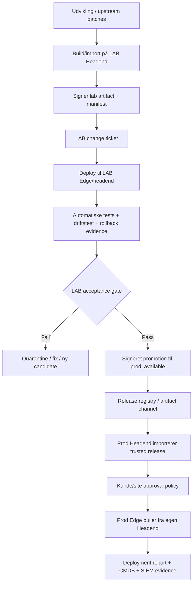

# TimeLapse Pro - Release promotion methodology

Dato: 2026-06-05
Status: Arkitekturbeslutning / implementeringsgrundlag
Scope: Timelapse Pro app, OS updates, security patches, application/dependency updates og kundedistribuerede releases.

## Beslutning

Ingen update må være tilgængelig for produktion, før den er installeret, testet og accepteret i LAB.

Production Headends og production Edges må kun se releases fra en `prod_available` kanal. En release bliver først `prod_available`, når LAB har produceret signeret evidence for:

- artifact er bygget eller importeret af Headend
- manifest og indhold er signeret
- install er gennemført i LAB på relevant hardwareklasse
- smoke/health tests er bestået
- rollback er testet eller eksplicit risikovurderet
- change ticket er godkendt
- release er promoted af en godkendt rolle

Edge må ikke være update authority og må ikke kræve direkte Internet/GitHub/ekstern apt. Edge henter kun godkendte artifacts fra sin Headend.

## Målmodel



## Release-kanaler

Alle artifacts skal ligge i præcis én kanal ad gangen.

| Kanal | Formål | Synlig for prod? | Krav |
|---|---|---:|---|
| `candidate` | Ny release/patch er oprettet, men ikke testet | Nej | Manifest, hash, kategori |
| `lab_ready` | Klar til LAB-installation | Nej | Signeret artifact, change ticket draft |
| `lab_deployed` | Installeret i LAB | Nej | Per-target deployment report |
| `lab_accepted` | LAB-test bestået | Nej | Test evidence, rollback evidence, signeret LAB acceptance |
| `prod_available` | Må importeres/godkendes i produktion | Ja | Signeret promotion, immutable artifact |
| `prod_deployed` | Installeret i produktion | Ja | Deployment report, CMDB update, audit |
| `quarantined` | Må ikke installeres | Nej | Årsag, incident/change reference |
| `revoked` | Trukket tilbage | Nej | Revocation reason, signer, affected scope |

## Miljøer

### LAB

LAB er release-valideringsmiljøet. LAB må have mere direkte adgang til upstream kilder, men kun Headend må bygge/importere artifacts.

LAB skal mindst have:

- en LAB Headend
- mindst én Edge pr. relevant hardwareklasse
- samme update-agent kontrakt som produktion
- testkamera eller simuleret capture pipeline
- signing keys for LAB artifacts og LAB acceptance
- kontrolleret mulighed for rollback og fejlinjektion

### Staging / pilot

Staging er valgfri, men anbefales når en update rammer mange kunder eller har høj risiko.

Staging kan være:

- intern pilot site
- kundepilot
- begrænset production scope med ekstra overvågning

Staging må kun modtage releases fra `prod_available`.

### Production

Production Headend må ikke bygge eller opdage upstream patches som direkte Edge-actions. Den må:

- importere `prod_available` artifacts fra trusted release channel
- reconcile mod egne Edges og CMDB
- kræve lokal/kunde approval
- distribuere artifact til egne Edges
- rapportere anonymiseret/tenant-godkendt deployment status tilbage, hvis kunden tillader det

## Multi-headend model

Der kommer tre realistiske topologier.

### 1. Central SaaS Headend

Én production Headend styrer flere kunder/sites. Den importerer kun `prod_available` releases og bruger tenant-isolerede approvals.

### 2. Flere production Headends til load balancing

Flere Headends deler samme trusted release registry. Release-state replikeres som immutable artifacts, ikke som løse scripts.

Krav:

- samme release signing trust root
- samme artifact IDs og hashes på alle Headends
- per-Headend deployment state
- ingen Headend må ændre artifact efter promotion

### 3. Kunde-ejet Headend

Kunden kontrollerer egen Headend og egne Edges, men kan abonnere på TimeLapse Pro release channel.

Krav:

- kunden importerer kun signerede `prod_available` releases
- kunden kan kræve egen lokal approval før deployment
- kunden kan fravælge telemetry tilbage til leverandør
- leverandør kan revokere eller markere releases som superseded/revoked
- kundens Headend skal kunne dokumentere chain of custody: vendor signature -> customer import -> customer approval -> edge deployment

## Mac Headend governance

Mac Headends er en separat platformklasse fra Linux Edge.

En Mac Headend kan være:

- LAB Headend
- central SaaS production Headend
- load-balanced production Headend
- kunde-ejet production Headend
- warm standby / backup Headend

Samme release-metodik gælder, men update-typerne håndteres forskelligt.

### TimeLapse Pro på Mac

TimeLapse Pro app/headend/UI updates skal distribueres som signerede Headend artifacts.

Produktions-Headend må ikke opdatere direkte fra GitHub i normal drift. Den må kun:

- importere et `prod_available` artifact
- verificere signature/hash
- installere til en kontrolleret release path
- migrere database efter change ticket
- køre smoke tests
- skifte aktiv version
- rollbacke til tidligere release ved fejl

Anbefalet installationsmodel:

```text
/opt/timelapse/releases/<artifact_id>/
/opt/timelapse/current -> releases/<artifact_id>
/opt/timelapse/previous -> releases/<old_artifact_id>
```

Mac Headend skal ikke køre ukontrolleret `git pull` i produktion.

### macOS OS updates

macOS updates er Apple-signerede og bør styres anderledes end Linux `.deb` artifacts.

For TimeLapse Pro betyder det:

- Headend registrerer macOS version/build, reboot-required og security state i CMDB.
- LAB validerer først en given macOS update på tilsvarende Mac hardware.
- Production får først en macOS update markeret som `prod_available`, når LAB acceptance findes.
- Selve installationen kan ske via MDM, Apple Software Update, lokal policy eller kundens device management, afhængigt af ejerskab.
- TimeLapse Pro skal dokumentere og auditere beslutningen, ikke nødvendigvis være den eneste tekniske installer for Apple OS updates.

Hvis kunden ejer Headend, kan kundens MDM være enforcement point, mens TimeLapse Pro stadig leverer:

- anbefaling
- compatibility evidence
- change ticket
- maintenance window
- post-update healthcheck
- compliance evidence

### Homebrew og tredjepart på Mac

Homebrew, Python, Node, nginx, PostgreSQL, OpenWebUI/Ollama, certbot og fail2ban må ikke opdateres ad hoc i produktion.

LAB skal producere en dependency release, der mindst binder:

- package name
- nuværende version
- target version
- source
- hash eller bottle/package reference
- compatibility test
- service restart impact
- rollback plan

Production Headend må kun installere dependency updates fra `prod_available` dependency artifacts eller fra en godkendt intern package/cache-kanal.

Mac Headend må ikke være afhængig af, at Homebrew upstream er tilgængelig under deployment.

### Mac service health

Efter Mac Headend update skal acceptance mindst teste:

- `launchd` service status for Headend API
- PostgreSQL connectivity
- nginx `80/443`
- UI svarer HTTPS `200`
- `/health` svarer OK
- OpenWebUI/Ollama status hvis aktivt
- SFTP/ingress path hvis aktivt
- Edge heartbeat modtages
- capture upload kan modtages
- backup job status
- SIEM events modtages

### Mac rollback

Rollback skal være forskellig pr. update-type:

| Type | Rollback |
|---|---|
| TimeLapse Pro app | Skift `current` symlink tilbage til tidligere release, genstart services |
| UI | Skift til tidligere build artifact |
| DB migration | Kun reversible migrations eller dokumenteret restore-plan |
| Homebrew/dependencies | Pin tidligere version eller restore fra package artifact/backup |
| macOS OS | Typisk ikke simpel rollback; kræver snapshot/backup/restore plan og ekstra godkendelse |

macOS updates skal derfor have højere change-risk, hvis rollback ikke er praktisk.

### Co-resident software på Mac Headends

En Mac Headend kan have software installeret, som ikke tilhører TimeLapse Pro. Det må ikke blandes sammen med TimeLapse Pro release governance.

Eksempel: CrushFTP 11 Enterprise 1 kan eksistere på samme Mac og kan kollidere med TimeLapse Pro, hvis begge forsøger at eje samme porte eller TLS/frontend-funktion.

Derfor skal hvert Mac Headend have et lokalt asset- og portregister med tre klasser:

| Klasse | Beskrivelse | Update governance |
|---|---|---|
| `TLP-managed` | Direkte del af TimeLapse Pro, fx Headend API, UI, nginx config, node-agent, syslog receiver | Må kun opdateres via TimeLapse release flow |
| `TLP-platform` | Delt platformkomponent TimeLapse afhænger af, fx PostgreSQL, nginx, Python venv, Node runtime, Ollama/OpenWebUI hvis aktiveret | Må kun ændres efter LAB-test og change ticket |
| `Co-resident/foreign` | Software som ikke er del af TimeLapse Pro, fx CrushFTP, andre kundeværktøjer, VNC/Apple services | Må ikke opdateres af TimeLapse. Skal registreres som dependency/risk hvis den deler porte, certifikater, storage eller identitet |

TimeLapse Pro må aldrig kritikløst opdatere `Co-resident/foreign` software.

Hvis co-resident software påvirker TimeLapse Pro, skal den registreres som en ekstern dependency med:

- owner
- formål
- version
- vendor/update-kanal
- lytteporte
- TLS/certifikatbrug
- storage paths
- service account/privilegier
- kendte konfliktpunkter
- aftalt update owner
- testkrav ved ændring

### Mac Headend port ownership

Hver Headend skal have et port ownership register. En TimeLapse release må ikke installeres, hvis den introducerer en portkollision med en registreret service.

Foreløbig portmodel for den nuværende Mac Headend:

| Port | Binding | Owner | Formål |
|---:|---|---|---|
| 80 | `0.0.0.0` | `TLP-managed` | nginx HTTP redirect/ACME |
| 443 | `0.0.0.0` | `TLP-managed` | nginx HTTPS UI/API/OpenWebUI proxy |
| 8000 | `0.0.0.0` | `TLP-managed` | Headend FastAPI |
| 5432 | `127.0.0.1` | `TLP-platform` | PostgreSQL |
| 5514 | `127.0.0.1` | `TLP-managed` | SIEM/syslog receiver |
| 22222 | `0.0.0.0` | `TLP-managed/platform` | SFTP/ingress |
| 11434 | `127.0.0.1` | `TLP-platform` | Ollama |
| 8080 | `127.0.0.1` | `TLP-platform` | OpenWebUI, hvis aktiv |
| 22 | `0.0.0.0` | `Host/platform` | SSH admin |
| 5900 | `0.0.0.0` | `Host/platform` | macOS screen sharing/VNC |
| 88 | `0.0.0.0` | `Host/platform` | Kerberos/system service |
| 2201 | `0.0.0.0` | `Co-resident/unknown until classified` | Skal klassificeres før production |
| 5000/7000 | `0.0.0.0` | `Co-resident/unknown until classified` | Skal klassificeres før production |

CrushFTP skal registreres eksplicit, inklusive de porte den bruger eller kan konfigureres til at bruge. Hvis CrushFTP skal bruge `80/443`, skal TimeLapse Pro og CrushFTP ikke begge binde direkte til portene. En reverse proxy-ejer skal vælges.

Anbefalet regel:

- Kun én service ejer public `80/443`.
- På TimeLapse Headend er default owner `TLP-managed nginx`.
- Co-resident webapps skal bag nginx med separate hostnames eller bruge ikke-kolliderende porte.
- Hvis en kunde kræver CrushFTP som public service, skal det være en dokumenteret arkitekturbeslutning og testes i LAB på samme portmodel.

### Mac software update policy

Mac Headend updates opdeles i fire scopes:

1. **TimeLapse Pro scope**
   - TimeLapse app/headend/UI/config.
   - Installeres kun via TimeLapse artifact promotion.

2. **TimeLapse platform scope**
   - PostgreSQL, nginx, Python, Node, Ollama/OpenWebUI, fail2ban/cert tooling.
   - Installeres kun efter LAB-test, compatibility evidence og change ticket.

3. **Host OS scope**
   - macOS security/functional updates.
   - Styres via MDM/Apple policy eller manuel host governance, men TimeLapse skal have compatibility evidence og post-update healthcheck før production rollout.

4. **Foreign application scope**
   - CrushFTP og andet ikke-TimeLapse software.
   - TimeLapse må ikke patche det.
   - TimeLapse skal kun registrere konflikt-/dependency-risiko og kræve re-test, hvis foreign owner ændrer software, porte, certifikater eller storage.

### Pre-flight conflict checks

Før en Mac Headend release eller platform update må installeres i LAB/prod, skal pre-flight mindst kontrollere:

- forventede porte er ledige eller ejet af korrekt service
- ingen ukendt service lytter på TimeLapse-owned porte
- nginx config owner og virtual hosts er som forventet
- certifikat paths og SAN/hostnames matcher
- PostgreSQL major version matcher testet version
- Homebrew packages er pinnet eller matcher godkendt manifest
- launchd services matcher godkendt service inventory
- co-resident software inventory er uændret eller ændringen har separat approval

Hvis pre-flight finder en ukendt service på en TimeLapse-port, skal deployment stoppe som `blocked`, ikke forsøge at rette automatisk.

## Artifact-typer

### Timelapse Pro app

Artifact skal indeholde:

- commit/tag
- release notes
- edge/headend/ui filmanifest
- hashes
- signer
- SBOM eller dependency summary
- test evidence reference
- rollback target

Edge må installere app updates fra Headend artifact. Edge må ikke køre `git fetch`/`git pull` i produktion.

### OS security

Artifact skal indeholde:

- liste af `.deb` pakker
- package name
- installed version
- target version
- source repo
- CVE/security classification hvor tilgængeligt
- sha256 og size for hver pakke
- install order eller lokal apt repo metadata
- reboot-required flag
- rollback/mitigation note

Edge må ikke køre `apt-get upgrade` mod eksterne repositories. Edge må installere lokalt fra Headend artifact, fx via lokal package cache/repo og `dpkg`/offline apt.

### OS functional

Samme som OS security, men med lavere default urgency og typisk manuel approval.

### Application/dependency updates

Gælder fx Python packages, Node packages, gphoto2, nginx, PostgreSQL, OpenWebUI/Ollama, certbot og fail2ban.

Krav:

- dependency/SBOM diff
- vulnerability summary
- compatibility test
- rollback plan

## Gating-regler

### Candidate gate

En candidate må kun oprettes hvis:

- artifact manifest findes
- kategori er klassificeret
- scope/hardwareklasse er angivet
- artifact hash er beregnet

### LAB install gate

En LAB deploy må kun starte hvis:

- artifact er signeret
- LAB change ticket findes
- LAB target er registreret i CMDB
- rollback target eller rollback exception findes

### LAB acceptance gate

En release kan kun blive `lab_accepted` hvis:

- install report er `deployed`
- service health er OK
- Edge heartbeat er OK
- capture/upload path er OK for Edge-releases
- UI/API smoke test er OK for Headend/UI-releases
- SIEM/audit events er modtaget
- rollback er testet eller formelt undtaget

### Production availability gate

En release kan kun blive `prod_available` hvis:

- LAB acceptance er signeret
- release promotion er signeret af autoriseret rolle
- artifact er immutable
- change ticket er komplet
- release ikke er quarantined/revoked

### Production deployment gate

En production Headend må kun frigive en update til Edge hvis:

- release er `prod_available`
- lokal/kunde policy tillader update
- change ticket er godkendt
- maintenance window/reboot policy er opfyldt
- target device matcher scope og hardwareklasse
- failure threshold ikke er overskredet

## Roller

| Rolle | Må |
|---|---|
| Developer | Oprette candidate, tilføje release notes/test evidence |
| Release manager | Signere LAB artifact, starte LAB deployment |
| LAB approver | Godkende LAB acceptance |
| Security/compliance approver | Godkende high-risk/security releases |
| Platform admin | Promote til `prod_available` |
| Customer approver | Godkende deployment på kunde/site |
| Edge agent | Hente og installere godkendte artifacts, rapportere resultat |

## Minimum datamodel

Eksisterende tabeller kan bruges som fundament, men skal udvides/bruges mere konsekvent.

### `update_artifacts`

Tilføj/brug felter:

- `channel`
- `release_state`
- `artifact_type`
- `hardware_class`
- `requires_reboot`
- `supersedes_artifact_id`
- `revoked_at`
- `revoked_by`
- `revocation_reason`
- `lab_acceptance_ref`

### `change_tickets`

Skal binde:

- pending update
- artifact
- channel
- environment
- scope
- test evidence
- rollback plan
- maintenance window
- approvals

### `update_targets`

Skal være facit for deployment pr. target:

- `queued`
- `downloading`
- `verifying`
- `installing`
- `healthcheck`
- `deployed`
- `failed`
- `rollback_requested`
- `rolled_back`

### Ny `release_promotions`

Anbefalet ny tabel:

- `promotion_id`
- `artifact_id`
- `from_channel`
- `to_channel`
- `decision`
- `decided_by`
- `decided_at`
- `signed_payload_sha256`
- `signature`
- `evidence_refs`

## UI-krav

UI skal fremover have fire tydelige views.

### Release lab

- Candidate artifacts
- LAB deploy
- LAB teststatus
- LAB acceptance
- Quarantine/retry

### Release registry

- `lab_accepted`
- `prod_available`
- revoked/superseded
- artifact manifest
- signatures
- SBOM/test evidence

### Production approvals

- Change tickets
- Customer/site/device scope
- maintenance window
- reboot policy
- approve/reject

### Deployment cockpit

- per Headend
- per customer/site/device
- per target status
- failure threshold
- rollback requests
- CMDB status

## Compliance mapping

| Rammeværk | Kontrolidé |
|---|---|
| SABSA | Accountability, Integrity, Availability, Manageability og Auditability bindes til release gates |
| COBIT | BAI06 Managed IT Changes, BAI07 Managed Change Acceptance and Transitioning, DSS01 Operations |
| ISO 27001 | A.8.8 vulnerability management, A.8.9 configuration management, A.8.32 change management |
| IEC 62443 | Secure update, trusted components, least privilege og asset owner control |
| CRA | Security updates, vulnerability handling, SBOM og product lifecycle evidence |
| GDPR | Tenant isolation, audit, least access og kundekontrol ved kunde-ejede Headends |

## Implementeringsrækkefølge

1. **Stop usikre paths**
   - OS update må ikke bruge direkte `apt-get upgrade`.
   - App update må ikke bruge direkte GitHub i production.
   - Approval skal blokere uden artifact.

2. **Release state model**
   - Indfør channels/states i artifact/update-flow.
   - Gør `prod_available` til eneste kilde for production Headends.

3. **LAB acceptance**
   - Byg UI/API for LAB deploy og evidence.
   - Tilføj smoke tests og rollback evidence.

4. **OS artifact builder**
   - Headend downloader/cache'r `.deb` pakker.
   - Manifest signeres.
   - Edge installerer offline.

5. **Multi-headend release registry**
   - Import/export af signerede release bundles.
   - Customer-owned Headend kan importere uden at give leverandør kontrol over drift.

6. **Production cockpit**
   - Per-target status, failure thresholds, staged rollout og rollback.

## Ikke-mål

Dette flow betyder ikke, at alle production Headends automatisk skal deploye alle releases.

`prod_available` betyder kun:

- release er testet og må tilbydes til production
- lokal Headend/kunde skal stadig afgøre om, hvornår og hvor den installeres

## Kort driftsregel

Hvis en update ikke har denne kæde, må den ikke i produktion:

```text
artifact -> LAB deploy -> LAB evidence -> signed LAB acceptance -> signed promotion -> prod_available -> local approval -> Edge pull -> deployment report
```
