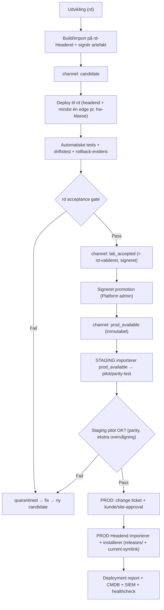

# TimeLapse Pro — Staging→Prod promotion-flow (v1)

**Dato:** 2026-07-16 · **Forfatter:** Claude (Cowork) · **Status:** Bro-/driftsdokument. Kobler den eksisterende release-metodik til den aktuelle 3-maskiners topologi og headend-generatoren. IKKE afprøvet end-to-end.
**Bygger på:** `Release_Promotion_Methodology_2026-06-05.md` (kanal-/gate-modellen — stadig gældende), `MILJOE_ARKITEKTUR_RD_STAGING_PROD_v1.md` (topologi), `HEADEND_GENERATOR_v1.md` (provisioning). Følger ADR-001 (release/promotion er en **platform**-egenskab).

> **Formål:** Gøre det konkret hvordan en release (eller en helt ny prod-headend) kommer fra `rd` → `staging` → `prod` — med gates, evidens, rollback og CMDB/SIEM — uden at røre CrushFTP og uden at give agenter adgang til staging/prod.

---

## 1. Terminologi-afstemning (vigtig — to dokumenter bruger forskellige ord)

`Release_Promotion_Methodology_2026-06-05.md` blev skrevet FØR miljø-terminologien blev fastlagt. Den siger **"LAB"** om valideringsmiljøet; i dag hedder det **`rd`** (og "lab" er nu reserveret til per-kamera debug-tilstand, R17). Afstemning:

| Metodikkens ord (2026-06-05) | Aktuelt (MILJOE_ARKITEKTUR v1) | Fysisk |
|---|---|---|
| "LAB Headend" | **`rd`** | Mac Mini, `timelapse.froekjaer.dk` |
| "Staging / pilot" | **`staging`** | iMac, software-parity, Travbyen-data |
| "Production" | **`prod`** | Nyt system, `timelapsepro.dk`, live CrushFTP |

Release-**kanalerne** (`candidate → lab_ready → lab_deployed → lab_accepted → prod_available → prod_deployed`) er uændret gyldige — de er en egenskab ved artefakten, ikke ved en maskine. Bemærk at kanalnavnene beholder "lab"-præfikset (`lab_accepted`) selvom miljøet nu hedder `rd`; det er et databasefelt og omdøbes IKKE nu (additivt, undgå skema-brud). Læs `lab_accepted` som "valideret i rd".

---

## 2. To spor der bruger samme metodik

Der er to ting man promoverer fra staging til prod. De deler gate-model, men er ikke det samme:

**Spor A — Software-release** (en ny TimeLapse Pro-version/patch/dependency): en artefakt bevæger sig gennem kanalerne. Dækket i detaljer af metodikken; §3 nedenfor viser den konkrete rd→staging→prod-vej.

**Spor B — Ny headend (provisioning)**: at rejse en helt ny staging- eller prod-maskine. Her bruges **headend-generatoren** (`HEADEND_GENERATOR_v1.md`): dens Fase 1 (Stage) henter netop en **signeret release** — og den release skal være `prod_available` før den må installeres på en prod-maskine. §4 nedenfor.

De to spor mødes: generatorens "signerede release" ER en artefakt fra Spor A's kanalmodel.

---

## 3. Spor A — Software-release fra rd → staging → prod

**Nøglepointer:**
- **`rd` er valideringsmiljøet** (metodikkens "LAB"): kun rd-Headend må bygge/importere artefakter og producere signeret acceptance-evidens.
- **`staging` modtager KUN `prod_available`** (aldrig en utestet candidate) — dens rolle er software-parity/pilot, ikke primær validering. Det er her man fanger sameksistens-/versionsproblemer med prod-lignende software (inkl. CrushFTP-parity) FØR prod.
- **`prod` importerer kun `prod_available`**, kræver lokal/kunde-approval, og installerer via release-path + `current`-symlink (`/opt/timelapse/releases/<id>` → `current`), aldrig `git pull`.
- Hele kæden skal have den signerede chain-of-custody fra metodikkens driftsregel: `artifact → rd deploy → rd evidence → signed acceptance → signed promotion → prod_available → local approval → deploy → report`.

---

## 4. Spor B — Ny headend via generatoren (rd-valideret → staging → prod)

At standardisere en ny maskine er også en promotion: generatorens Stage-fase (Fase 1) må på en **prod**-maskine kun hente en release-tag der svarer til en `prod_available`-artefakt.

1. **rd:** byg/valider release som normalt (§3) → `prod_available` med en signeret tag + commit-SHA.
2. **staging:** kør generatoren mod den `prod_available` tag (`bootstrap_headend_macos.sh --mode stage --release-tag v<X.Y.Z> --expected-commit <sha>`), Apply, Enroll i CMDB. Verificér software-parity + at CrushFTP-sameksistens holder (8443, ingen portkollision). Dette er staging-pilotens formål.
3. **prod:** samme generator-flow mod **samme** `prod_available` tag/commit — aldrig en nyere/utestet. Change ticket + kunde-approval først. Enroll i CMDB → maskinen er nu synlig og under config-control.

Fordi generatoren pinner **både tag OG commit-SHA** og GPG-verificerer, er "samme release på staging og prod" teknisk håndhævet, ikke kun en aftale — det matcher metodikkens multi-headend-krav ("samme artifact IDs og hashes på alle Headends").

---

## 5. Gates & evidens (konkret for staging→prod)

Genbrug metodikkens gates, anvendt på de tre maskiner:

| Gate | Hvor | Krav (uddrag) |
|---|---|---|
| rd acceptance | `rd` | install `deployed`, service-health OK, edge-heartbeat, capture/upload OK, UI/API-smoke, SIEM-events, rollback testet/undtaget → **signeret** |
| prod availability | (promotion) | rd-acceptance signeret, promotion signeret af Platform admin, artefakt immutabel, change ticket komplet, ikke quarantined/revoked |
| **staging pilot** | `staging` | importeret fra `prod_available`; software-parity bekræftet; ekstra overvågning; **pre-flight conflict check** (porte, nginx-owner, cert-paths, Postgres-major, co-resident CrushFTP uændret) |
| prod deployment | `prod` | `prod_available`; lokal/kunde-policy tillader; change ticket godkendt; maintenance window; target matcher scope/hw-klasse; failure threshold ikke overskredet |

**Mac service health efter deploy (rd/staging/prod, jf. metodikken §Mac service health — port rettet):** launchd headend-API, PostgreSQL, **nginx på 8443** (IKKE 80/443 på staging/prod), UI HTTPS 200, `/api/health` OK, Ollama/OpenWebUI hvis aktivt, SFTP 22222, edge-heartbeat, capture-upload, backup-job-status, SIEM-events.

---

## 6. ⚠️ To uoverensstemmelser i metodik-dokumentet der bør afstemmes (additivt flag)

`Release_Promotion_Methodology_2026-06-05.md` er ellers stadig retvisende, men to ting stammer fra før senere beslutninger og bør rettes/anmærkes dér (ikke stiltiende — dette dokument overstyrer den ikke):

1. **Port-modellen (§Mac Headend port ownership)** viser nginx som `TLP-managed` ejer af **80/443**. Det gælder KUN `rd` (ingen CrushFTP dér). På `staging`/`prod` ejer **CrushFTP** 80/443, og TimeLapse skal på **8443** (DNS-01). Metodikkens egen §"Co-resident software" + §"Mac Headend port ownership" anerkender konflikten men konkluderer den ikke — den er nu afgjort: 8443, CrushFTP urørt (se `PORT_AUDIT_og_WEBSITE_v10.md`, `deploy/PORTS.md`, `HEADEND_GENERATOR_v1.md` §5).
2. **"LAB"-terminologien** bør læses som `rd` (jf. §1). Kanal-feltnavne (`lab_accepted`) beholdes i DB, men prosaen bør afstemmes ved næste revision.

Anbefaling: tilføj en kort note øverst i metodik-dokumentet der peger på §1 og §6 her, så en ny læser ikke forvirres. (Selve metodik-dokumentet er en arkitekturbeslutning; jeg rører den ikke uden Peters ok.)

---

## 7. Standarder (kort — fuld mapping i metodikken §Compliance)

- **COBIT** BAI06/BAI07 (managed change + acceptance/transition), **DSS01** drift.
- **ISO 27001** A.8.32 change mgmt, A.8.9 config mgmt, A.8.8 vuln mgmt.
- **IEC 62443** secure update, trusted components, asset-owner control (kunde-approval-gate).
- **CRA** security updates + SBOM + lifecycle-evidens pr. promotion.
- **GDPR** tenant-isolation + kundekontrol ved kunde-ejede headends; staging bruger Travbyen-data under eksisterende DPA + eksplicit udviklingstilladelse (MILJOE_ARKITEKTUR §4).

---

## 8. Action items

- **Peter (beslutning):** bekræft at `staging` altid modtager `prod_available` (ikke en særskilt staging-kanal) — dvs. staging = pilot af det der allerede er prod-klar, ikke et ekstra valideringstrin før prod_available. (Metodikken siger dette; jeg bekræfter bare intentionen.)
- **Codex (kode, når relevant):** `release_promotions`-tabellen (metodik §Minimum datamodel) er den manglende brik for signeret promotion-evidens; den + `channel`/`release_state`-felterne på `update_artifacts` er forudsætning for at gate'e prod_available maskinelt. Koordinér med din igangværende update-flow/change-ticket-kode.
- **Claude (docs):** når `release_promotions` findes + staging er rejst, opdater dette dokument v1→v2 med testede kommandoer og en faktisk promotion-kørsel som evidens.
- **Fælles:** afstem metodik-dokumentets port-/terminologi-noter (§6).
