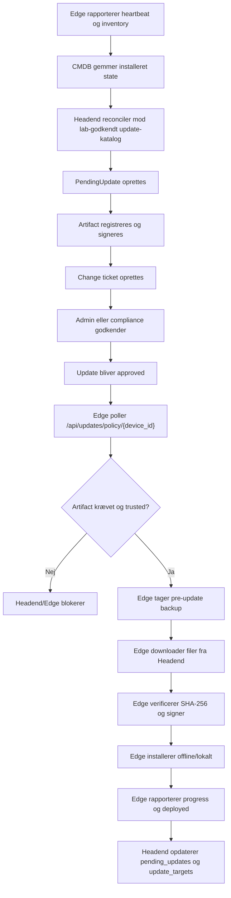

# TimeLapse Pro — Update-flow (v10, konsolideret): E2E QA, brugermanual, gates og OS-bundle

**Version:** 10 (konsolideret, revideret)
**Dato:** 2026-08-03
**Konsoliderer:** `Update_Flow_E2E_QA_og_Brugermanual_2026-06-21.md` (backbone), `Update_Approval_Deploy_Flow_2026-06-05.md` (API + OS offline bundle), `Update_Flow_Guide_2026-06-03.md` (reconcile-kommandoer), `Update_Flow_Testplan_2026-06-12.md` (gates). Tidligere versioner arkiveret i `Gamle versioner/`. Styrende metodik: `Release_Promotion_Methodology_2026-06-05.md`.

Oprindelig scope-note (backbone):
Scope: Headend Mac mini, aktiv Edge `TL-C87FF9587CA0` (Nikon/Orange Pi 4 Pro), update-flow, artifact-katalog, change ticket, Edge pull/install/report og operatørmanual.  
Status: Pre-production QA. Systemet er ikke sat i egentlig produktion.

## Kort forklaret: sådan holder vi systemet sikkert

Tænk på TimeLapse Pro som et system med en central kvalitetskontrol og en eller flere kameraenheder i marken.

1. Edgen fortæller Headend, hvad der faktisk er installeret: operativsystem, programmer og biblioteker. Den behøver ikke internet for at gøre dette.
2. Headend sammenligner listen med sine kontrollerede kataloger. Det foregår på Headend, som er systemets godkendte forbindelse til leverandører og sikkerhedsinformation.
3. Hvis der findes noget nyt, opretter systemet en kandidat. Den installeres ikke endnu. Kandidaten beskriver præcist, hvilke versioner der skal fra og til, og om der er tale om sikkerhed eller funktion.
4. I laboratoriet henter Headend de nødvendige filer, tester dem og pakker dem i en lukket pakke. Pakken får indholdsfortegnelse, hash og digital signatur.
5. En administrator godkender pakken til test, staging eller produktion efter den relevante testplan.
6. Edgen henter kun den godkendte pakke fra Headend. Før installation tages en backup. Edgen kontrollerer underskrift og indhold og rapporterer resultatet tilbage. Ved fejl bliver resultatet synligt i UI og SIEM.

For OS-pakker pakker Edgen først hele det signerede `.deb`-sæt ud og konfigurerer derefter den samlede `dpkg`-transaktion. Edgen bruger hverken APT-indeks, `apt update` eller netværk; mangler der noget i pakken, stopper konfigurationen med en tydelig fejl og kan rulles tilbage fra backup.

Det betyder i praksis, at en Orange Pi ikke selv kører `apt upgrade`, ikke henter fra GitHub og ikke behøver direkte internet. Headend er den eneste kontrollerede distributionskanal.

### Hvad er en SBOM?

En SBOM er systemets varedeklaration: en maskinlæsbar liste over de programmer og biblioteker, som er installeret på en given Headend eller Edge. Den gør det muligt at svare på: "Har vi denne berørte komponent, hvilken version har vi, og hvor er den anvendt?"

### Natlig kontrol af SBOM og opdateringer

Målprocessen er en daglig, natlig kontrol på Headend. Den skal validere, at hver registreret enhed har et friskt og læsbart SBOM/inventar; sammenligne OS-pakker, applikationer og biblioteker med relevante, kontrollerede opdaterings- og sårbarhedskilder; og gemme et dateret, hash-beskyttet resultat.

Komponenter uden en troværdig advisory-kilde markeres som et dækningsgab, ikke som fejlfrie. E-mail sendes ved advarsler, SMS ved nye kritiske fund, og en fejlet kontrol er selv et alarmerbart fund. Kontrollen installerer aldrig noget automatisk; den skaber kun evidens og kontrollerede kandidater.

### Forklaring til forskellige modtagere

**Til en makker:** Vi arbejder med en software supply-chain: inventar → katalogsammenligning → testet og signeret artifact → godkendelse → Edge-pull → backup, verificering og statusrapportering. Ingen Edge har en implicit internetvej for updates.

**Til en kunde:** Vi ved løbende, hvilken software der bruges på kundens enheder. Når en sikkerhedsopdatering er relevant, testes og godkendes den før udrulning. Kunden kan vælge, hvilke kategorier der må opdateres automatisk.

**Til en auditør:** Der etableres sporbar evidens fra installeret komponent til SBOM, sårbarheds-/opdateringsvurdering, testresultat, signeret artifact, change ticket, godkendelse, backup og faktisk installationsrapport. Et kontrolsvigt er i sig selv et alarmerbart fund.

## Aktuel statusopdatering 2026-08-03

Dette afsnit erstatter ældre udsagn i dokumentet om, at den aktive Edge havde nul OS-opdateringer. En Headend-baseret CMDB-katalogkørsel for `TL-C87FF9587CA0` identificerede først **126 sikkerhedsopdateringer** og **20 funktionelle OS-opdateringer**. Sikkerhedsopdateringen `#136` blev den 2026-08-03 afsluttet i LAB med pre-update-backup og signerede offline artifacts. Den sidste recovery-transaction bestod af de to manglende afhængigheder `libasound2-data` og `libpam-modules`, der konfigurerede en tidligere afbrudt PipeWire-transaktion korrekt. `#134` (20 funktionelle OS-opdateringer) er fortsat blokeret og er **ikke** installeret.

Katalogopdagelsen er rettet til at køre på Headend med dagligt interval og til at gemme planer/artifacts permanent under det logiske dataområde `/data-fast`. Den næste konkrete opgave er at færdiggøre og verificere den natlige SBOM-/advisory-kontrol beskrevet ovenfor.

## Sådan bruges Update-menuen

Hele den normale proces styres i UI under **Opdateringer**. En administrator
skal normalt kun arbejde med fanerne **Afventer**, **Godkendt** og
**Deployet**. Fanerne **Blokeret**, **Erstattet**, **Afvist** og **Rullet
tilbage** er drift-, fejlsøgnings- og auditspor, ikke den normale kø.

| UI-område | Hvad det bruges til | Normal brugerhandling |
|---|---|---|
| **CMDB → enhed/SBOM** | Installerede OS-pakker, applikationer, biblioteker og rapporteringstidspunkt. | Kontrollér at den aktive enhed har frisk inventar. |
| **Opdateringer → Afventer** | Nye, signerede og test-klare kandidater. | Fold rækken ud og vælg **Godkend** til LAB. |
| **Opdateringer → Godkendt** | Godkendt til en konkret Edge eller Headend og venter på næste pull/poll. | Følg den udfoldede flow-status. |
| **Opdateringer → Deployet** | Gennemført installation med målstatus, backup og rapportering. | Verificér testresultatet og beslut eventuel promovering. |
| **Opdateringer → Blokeret** | En konkret afvigelse eller en kortvarig automatisk artifact-forberedelse. | Læs årsagen; brug ikke **Genprøv** på historiske poster. |
| **Opdateringer → Erstattet** | Tidligere kandidater, der er afløst af nyere kandidater. | Audit/reference; ingen udrulning. |
| **Opdateringer → Afvist / Rullet tilbage** | Afvist change eller mislykket/tilbageført installation. | Fejlsøgning eller formel change-beslutning. |
| **Compliance / GRC og SIEM** | Risiko, kontroller, alarmer og evidens. | Følg op på kritiske fund og dokumentér disposition. |

### Statusmodel

| Status | Betydning | Næste trin |
|---|---|---|
| **Afventer** | Artifact, hash, signatur og change-oplysninger er klar. Kandidaten er klar til menneskelig godkendelse til LAB-test. | Godkend. |
| **Godkendt** | Godkendt til målmiljøet. Headend venter på Edge-heartbeat/poll eller Headend-installationsflow. | Følg den udfoldede flow-status. |
| **Deployet** | Mål-enheden har rapporteret gennemført installation. | Udfør og dokumentér test; promover kun beståede LAB-kandidater. |
| **Blokeret** | Artifact, forudsætning eller konkret fejl mangler. Ved automatisk OS-forberedelse kan status være kortvarig, mens Headend bygger bundle. | Læs årsagen eller afvent det automatiske build. |
| **Erstattet** | En nyere kandidat repræsenterer samme ændring bedre. Posten bevares for sporbarhed. | Ingen handling. |
| **Afvist** | Change er bevidst fravalgt med begrundelse. | Opret eller afvent en ny kandidat ved fortsat behov. |
| **Rullet tilbage** | Installationen er tilbageført eller kræver kontrolleret recovery. | Undersøg SIEM, backup og change ticket. |

### Konkret eksempel: aktiv R&D-Edge

For `TL-C87FF9587CA0` er den aktuelle kø:

1. **OS sikkerhed - oprindeligt 126 pakker**: `#136` er **Deployet** i LAB.
   Evidens: artifact `TL-OS-20260803-b721741294b2`, pre-update backup og Edge-
   rapport med installation returkode 0.
2. **OS opdatering - 20 pakker**: kandidat `#134` er **Blokeret** i LAB og
   afventer separat offline artifact-build, test og godkendelse.
3. Når et artifact er bygget og bundet, ligger kandidaten under **Afventer**.
4. Administratoren godkender derfra til LAB. Under **Godkendt** ses femtrins-
   flowet: godkendelse, Edge-poll, trust-check, pre-update backup og
   installation/rollback.
5. Efter en succesfuld installation vises kandidaten under **Deployet**.
   Først efter dokumenteret LAB-test kan den promoveres til staging eller prod.

De tidligere poster fra juli ligger under **Erstattet**. De slettes ikke, fordi
de er change- og revisionshistorik, men de må ikke bruges som nye kandidater.

## Executive summary

Den friske E2E-kørsel viser, at Headend-medieret app/artifact-update virker end-to-end på den aktive Edge `TL-C87FF9587CA0`.

Verificeret i dag:

- Headend health svarer på både `/health` og `/api/health`.
- Backend endpoint tests er grønne: `18 passed`.
- UI build er grøn.
- Aktiv Edge `TL-C87FF9587CA0` er online og rapporterer inventory.
- Edge henter policy fra Headend.
- Edge henter et signeret artifact fra Headend.
- Edge tager pre-update backup og uploader backup til Headend.
- Edge downloader, hash-verificerer og installerer en ikke-kørende QA-markerfil.
- Edge rapporterer `deployed` tilbage til Headend.
- `pending_updates` og `update_targets` viser deployet status.
- Agenten genstarter efter update og kommer aktivt op igen.

Det vigtige arkitekturkrav er opfyldt for denne app-update-test: Edge installerede fra Headend artifact og brugte ikke direkte GitHub, direkte Internet eller ekstern apt.

OS-update-flowet er understøttet i kode/UI som Headend-signeret offline bundle-flow, men der blev ikke installeret en rigtig OS update på den aktive Edge i denne QA-kørsel, fordi seneste CMDB-inventory for `TL-C87FF9587CA0` viser `0` tilgængelige OS-opdateringer. Den eneste åbne/pending update er #33, som peger på den stale/sekundære Edge `TL-DCA63234D813`.

## Testmål

Testen skulle bevise følgende minimumskæde:

1. Headend har en update-kandidat.
2. Artifact er registreret i Headend artifact-katalog.
3. Change ticket er oprettet og bundet til update.
4. Update er godkendt til et konkret device.
5. Edge poller Headend policy.
6. Edge får kun update, hvis artifact findes og er trusted.
7. Edge tager backup før installation.
8. Edge downloader artifact-filer fra Headend.
9. Edge verificerer SHA-256.
10. Edge installerer lokalt.
11. Edge rapporterer progress og slutstatus.
12. Headend opdaterer både overordnet update og per-target status.

## E2E-testkandidat

Der blev oprettet en sikker app-update, som kun installerer en markerfil:

| Felt | Værdi |
|---|---|
| Run ID | `qa-e2e-update-20260621-150321` |
| PendingUpdate ID | `34` |
| Artifact ID | `TL-QA-APP-20260621-150321` |
| Change ticket | `TL-CHG-20260621-00034` |
| Target Edge | `TL-C87FF9587CA0` |
| Update type | `app_updates` |
| Environment | `lab` |
| Installeret fil | `/opt/timelapse/edge/.qa/qa-e2e-update-20260621-150321.txt` |
| Artifact SHA-256 | `4b5d92337c032d2d4ac53b620267a33ca36fca6a16783321562fcf69365754a9` |
| Signer | `system-hash` |

Markerfilen er bevidst en ikke-kørende fil. Den ændrer ikke runtime-kode, services, kameraopsætning eller OS-pakker.

## E2E-evidens

### Headend health

Kommando:

```bash
curl -fsS http://127.0.0.1:8000/health
curl -fsS http://127.0.0.1:8000/api/health
```

Resultat:

```json
{"status":"ok","time":"2026-06-21T15:05:48.236711+00:00"}
{"status":"ok","time":"2026-06-21T15:05:48.255989+00:00"}
```

### Backend tests

Kommando:

```bash
/tmp/tlp-qa-venv/bin/python -m pytest tests/test_agent_integrity.py tests/test_headend_endpoints.py -q
```

Resultat:

```text
18 passed in 0.02s
```

### UI build

Kommando:

```bash
npm --prefix timelapse-ui run build
```

Resultat:

```text
✓ built
```

Kendte warnings:

- `DEP0205 module.register() is deprecated`
- `INEFFECTIVE_DYNAMIC_IMPORT` for `src/api/client.ts`
- Vite chunk over 500 kB

Warnings er ikke stopfejl, men bør senere ryddes i en UI quality sprint.

### Artifact

DB-evidens:

```text
artifact_id:   TL-QA-APP-20260621-150321
artifact_type: app
sha256:        4b5d92337c032d2d4ac53b620267a33ca36fca6a16783321562fcf69365754a9
signed_by:     system-hash
created_at:    2026-06-21 17:03:21.276418
source_ref:    qa-e2e-manual
filename:      TL-QA-APP-20260621-150321.manifest.json
size_bytes:    251
```

### Change ticket

DB-evidens:

```text
id:                15
ticket_id:         TL-CHG-20260621-00034
pending_update_id: 34
update_type:       app_updates
status:            approved
environment:       lab
scope:             device
scope_id:          TL-C87FF9587CA0
artifact_id:       TL-QA-APP-20260621-150321
signed_by:         system-hash
signed_at:         2026-06-21 17:03:21.294969
```

### Pending update

DB-evidens:

```text
id:                34
update_type:       app_updates
version:           qa-e2e-update-20260621-150321
status:            deployed
environment:       lab
scope:             device
scope_id:          TL-C87FF9587CA0
target_device_ids: ["TL-C87FF9587CA0"]
approved_by:       codex-qa
approved_at:       2026-06-21 17:03:21.276418
deployed_at:       2026-06-21 17:04:18.030531
```

### Per-target status

DB-evidens:

```text
id:                29
pending_update_id: 34
ticket_id:         TL-CHG-20260621-00034
device_id:         TL-C87FF9587CA0
artifact_id:       TL-QA-APP-20260621-150321
status:            deployed
attempt_count:     1
started_at:        2026-06-21 17:04:09.430303
completed_at:      2026-06-21 17:04:18.034074
last_report_at:    2026-06-21 17:04:18.034081
last_error:
```

### Edge markerfil

Kommando:

```bash
ssh orangepi@192.168.86.134 \
  "cat /opt/timelapse/edge/.qa/qa-e2e-update-20260621-150321.txt"
```

Resultat:

```text
TimeLapse Pro QA E2E update marker
run_id=qa-e2e-update-20260621-150321
artifact_id=TL-QA-APP-20260621-150321
device_id=TL-C87FF9587CA0
created_at=2026-06-21T15:03:21.276418+00:00
purpose=non-code marker artifact proving edge pull/install/report flow
```

### Edge service efter update

Kommando:

```bash
ssh orangepi@192.168.86.134 "systemctl is-active timelapse-edge"
```

Resultat:

```text
active
```

Service state:

```text
ActiveState=active
SubState=running
MainPID=36394
NRestarts=0
```

Edge git/app-state:

```text
e46635d
```

### Edge loguddrag

Relevante linjer fra `journalctl -u timelapse-edge`:

```text
Update-check: starter...
GET /updates/policy/TL-C87FF9587CA0 status=200
Udfører opdatering 34: app_updates
POST /updates/report status=200
Edge backup upload complete: timelapse-edge-backup-TL-C87FF9587CA0-20260621_150409.tar.gz
App update 34 pre-update backup OK: ... (2918 KB)
App update 34: henter 1 edge-filer fra artifact TL-QA-APP-20260621-150321
POST /updates/report status=200
App update 34 installeret fra signeret artifact - genstarter agent
```

Efter restart:

```text
=== TimeLapse Pro Edge Agent starting ===
GET /config/TL-C87FF9587CA0 status=200
POST /heartbeat/TL-C87FF9587CA0 status=200
POST /inventory/TL-C87FF9587CA0 status=200
GET /updates/policy/TL-C87FF9587CA0 status=200
```

## Aktuel CMDB-state

Aktiv Edge:

```text
device_id:      TL-C87FF9587CA0
ip_address:     192.168.86.134
last_seen:      2026-06-21 17:05:06
status:         online
location:       Frøkjær - Nordre Villavej 17c - Kamera 1
app_version:    e46635d
hardware_model: Orange Pi 4 Pro
hostname:       timelapse0101
os_name:        Ubuntu 24.04.4 LTS
kernel:         5.15.147-sun60iw2
python:         3.12.3
interface:      end0
storage used:   50.9 %
```

Seneste software inventory for aktiv Edge viser:

```json
"_os_updates_available": {
  "total": 0,
  "security": 0,
  "packages": []
}
```

Sekundær/stale Edge:

```text
device_id:  TL-DCA63234D813
ip_address: 192.168.86.121
last_seen:  2026-06-16 21:27:33
app_version: 2.8.0
```

Derfor blev #33 ikke brugt til frisk E2E-test. Den peger ikke på den aktive Edge `TL-C87FF9587CA0`, men på en stale/sekundær Edge, der ikke indgår i denne QA-kørsel.

## Flowoversigt



## Bruger Manual

### Roller

Typiske roller i update-flowet:

| Rolle | Formål |
|---|---|
| `super_admin` | Fuldt teknisk ansvar, kan godkende, promovere og fejlsøge. |
| `admin` | Normal drift, updates, artifacts, change tickets og compliance. |
| `operator` | Kan se compliance og acceptere relevante updates inden for egen kundescope. |
| Edge device | Må kun rapportere inventory/heartbeat og hente approved policy/artifacts. |

I produktion bør en kundeaccept være et change ticket eller compliance-accept med auditspor. Direkte teknisk approval bør reserveres til lab/test eller nødprocedurer.

### Hvor arbejder man i UI?

Primære menupunkter:

| UI | Bruges til |
|---|---|
| `Opdateringer` | Se pending/approved/deployed/rejected/rolled_back, artifacts, jobs og Edge flow-status. |
| `Compliance` | Se godkendelseskø, risk, GRC-kontroller og standardrapporter. |
| `CMDB` | Se devices, installerede versioner, inventory, SBOM og device-state. |
| `Backup` | Se Headend/Edge backupstatus og restore-evidens. |
| `Key Management` | Se API credentials, HMAC enforcement og stale credentials. |

### Normal update-proces

1. Gå til `CMDB`.
2. Kontroller at device er online, og at seneste inventory er frisk.
3. Gå til `Opdateringer`.
4. Kig i `Afventer`.
5. Fold update-linjen ud.
6. Læs beskrivelse, scope, miljø, artifact og Edge flow-status.
7. Hvis update mangler artifact, byg eller bind artifact først.
8. Godkend kun, når update har relevant lab-evidens og rollbackplan.
9. Efter godkendelse flytter update til `Godkendt`.
10. Edge henter update ved næste heartbeat/policy-pull.
11. Fold linjen ud for at se status: backup, download, verify, install eller deployed.
12. Når status er `deployed`, kontroller CMDB og eventuelt service/backup-evidens.

### Hvad betyder status?

| Status | Betydning | Normal handling |
|---|---|---|
| `pending` | Update afventer godkendelse. | Tjek artifact, ticket, scope og risiko. |
| `approved` | Update er frigivet til Edge policy. | Vent på Edge poll eller tjek Edge heartbeat. |
| `queued` | Per-target række er klar. | Vent på Edge. |
| `backing_up` | Edge tager pre-update backup. | Vent. |
| `downloading` | Edge henter artifact-filer fra Headend. | Vent eller tjek netværk/headend logs ved timeout. |
| `verifying` | Edge kontrollerer hash/signatur/file policy. | Vent. |
| `installing` | Edge installerer lokalt/offline. | Vent, afbryd ikke medmindre nødvendigt. |
| `deployed` | Update er installeret og rapporteret OK. | Kontroller drift/CMDB. |
| `blocked` | Update er stoppet før installation. | Læs `last_error` og flow-status. |
| `rolled_back` | Update fejlede og rollback blev forsøgt/udført. | Undersøg logs og backup. |
| `rejected` | Update er administrativt afvist. | Ingen installation sker. |

### Når en række siger "Afventer Edge"

Det betyder normalt ikke, at Headend pusher noget. TimeLapse Pro bruger pull-flow:

- Edge kalder Headend med `GET /api/updates/policy/{device_id}`.
- Headend returnerer kun updates, der matcher device/scope og har krævet artifact.
- Edge tager én update ad gangen.

Tjek i denne rækkefølge:

1. Er device `last_seen` frisk i CMDB?
2. Kører `timelapse-edge` på Edge?
3. Kan Edge nå Headend?
4. Er update scope korrekt?
5. Er `target_device_ids` korrekt?
6. Findes artifact og change ticket?
7. Viser `update_targets.last_report_at` nye timestamps?

### Når en update mangler artifact

For OS/app updates er artifact ikke valgfrit. Systemet skal blokere approval/install, hvis artifact mangler.

I `Opdateringer`:

1. Fold update ud.
2. Brug `Byg artifact og bind`, hvis det er en OS update og builderen er klar.
3. Brug manuel `Bind artifact` kun til fejlsøgning eller kontrolleret lab.
4. Kontroller at artifact vises i `Signeret artifact-katalog`.
5. Godkend først derefter.

### Når man trykker "Promover til prod"

Promotion betyder ikke "installer straks".

Forventet flow:

1. En lab/test/staging update skal have deployed evidens.
2. `Promover til prod` opretter en ny production update-kandidat.
3. Production-kandidaten ligger typisk som `pending`.
4. Admin/kunde skal godkende production-kandidaten.
5. Først derefter bliver den synlig for relevante Edge devices via policy-pull.

Hvis knappen ikke ser ud til at gøre noget, så tjek:

- Er kilde-update `deployed` i lab/test/staging?
- Findes der allerede en tilsvarende production update?
- Har brugeren `admin` eller `super_admin`?
- Har update et bundet artifact via change ticket?
- Kommer der en fejltoast i UI eller en API-fejl i browserens devtools?

### OS security og OS updates

Edge må ikke selv køre `apt-get upgrade` mod Internet.

Korrekt OS-flow:

1. Edge rapporterer installerede OS-pakker til CMDB.
2. Headend/lab-builder sammenligner mod et Headend-ejet, lab-testet katalog.
3. Headend bygger offline OS bundle.
4. Bundle indeholder `.deb` filer, manifest og scripts.
5. Headend validerer bundle file policy.
6. Headend registrerer og signerer artifact.
7. Artifact bindes til update.
8. Update godkendes.
9. Edge downloader bundle fra Headend.
10. Edge installerer offline fra lokale `.deb` filer.

Forbudte mønstre i OS bundle:

- `apt-get update`
- `apt-get upgrade`
- `apt dist-upgrade`
- `curl`, `wget`, `git pull`, `git fetch`
- `pip install`
- apt-kommandoer uden `--no-download`

### App og Timelapse Pro updates

App updates skal også komme fra Headend artifact.

For app artifacts installerer Edge kun filer fra manifestet, og kun paths der starter med `edge/`. Edge:

1. Tager backup af eksisterende Edge.
2. Henter artifact-filer.
3. Kontrollerer SHA-256 pr. fil.
4. Kopierer filer til `/opt/timelapse`.
5. Rapporterer `deployed`.
6. Genstarter `timelapse-edge`.

Legacy Git update er kun lab/dev nødvej og skal ikke bruges i produktion.

### Compliance-accept

I `Compliance` kan en operatør acceptere relevante updates. Systemet skal afvise accept, hvis update kræver artifact og artifact mangler.

Ved korrekt accept:

1. Systemet opretter eller genbruger change ticket.
2. Beslutningen signeres/hash-bindes.
3. Update bliver `approved`.
4. Edge kan hente den ved næste policy-pull.

### GRC-rapporter

Compliance dashboardet kan generere standard-specifikke rapporter for:

- SABSA
- IEC62443
- ISO27000
- NIS2
- CRA

Rapporterne er baseret på CMDB, SIEM, key lifecycle, artifacts, change tickets, backup/resilience og AI Ops evidence. De er beslutningsstøtte, ikke en ekstern audit-erklæring.

## Fejlsøgning

### DB-status for en update

```bash
psql postgresql://timelapse@localhost/timelapse_db -P pager=off -c "
select id,update_type,version,status,environment,scope,scope_id,approved_at,deployed_at
from pending_updates
where id=<UPDATE_ID>;

select id,pending_update_id,ticket_id,device_id,artifact_id,status,attempt_count,last_report_at,last_error
from update_targets
where pending_update_id=<UPDATE_ID>;
"
```

### Edge service og logs

```bash
ssh orangepi@<EDGE_IP> "systemctl is-active timelapse-edge"
ssh orangepi@<EDGE_IP> "journalctl -u timelapse-edge -n 160 --no-pager"
```

### Headend health

```bash
curl -fsS http://127.0.0.1:8000/api/health
```

### Typiske fejl

| Symptom | Sandsynlig årsag | Handling |
|---|---|---|
| `missing_headend_signed_artifact` | Update kræver artifact, men artifact er ikke bundet. | Byg/bind artifact. |
| `os_update_requires_headend_signed_offline_artifact` | Edge nægter OS update uden offline bundle. | Byg OS bundle via Headend. |
| `artifact_verification_failed` | Signer/hash/trust mismatch. | Kontroller artifact manifest og trusted signer. |
| `download failed` | Edge kan ikke hente artifact-fil fra Headend. | Tjek Headend endpoint, token/HMAC, nginx og netværk. |
| `sha256 mismatch` | Artifact-fil matcher ikke manifest. | Forkast artifact og byg nyt. |
| `pre_update_backup_upload_failed` | Edge kunne ikke uploade backup. | Tjek backup endpoint, diskplads og auth. |
| `waiting_for_edge_poll` | Headend venter på Edge pull. | Tjek heartbeat/service/scope. |

## Kendte restpunkter

1. OS-flow mangler en frisk E2E-installation på aktiv Edge med et reelt lab-bygget OS bundle, fordi aktiv Edge aktuelt rapporterer `0` OS updates.
2. Update #33 er stadig pending for stale Edge `TL-DCA63234D813`; den bør enten testes på den rette enhed eller afvises/erstattes, så den ikke forvirrer driften.
3. UI build har chunk/dynamic import warnings.
4. Tidligere ESLint backlog er ikke ryddet i denne QA-kørsel.
5. `pending_updates.deployed_count` blev ikke øget for #34, selv om `update_targets` viser `deployed`. Per-target status er korrekt, men count-felterne bør harmoniseres.
6. Edge log viser stadig kamera drift/config drift:
   - `focus_mode expected=Manual actual=AF-A`
   - `iso expected=Auto actual=100`
   - `white_balance expected=AWB White actual=Automatic`
7. CMDB viser stale Edge `TL-DCA63234D813` som `online` i `devices.status`; UI bør konsekvent bruge freshness/last_seen til visning.

## QA-konklusion

App/artifact update-flowet er funktionelt og evidensbaseret verificeret på aktiv Edge `TL-C87FF9587CA0`.

Det betyder, at kernen i pull-modellen virker:

- Headend er update authority.
- Edge henter selv.
- Artifact og change ticket er bundet.
- Pre-update backup sker før installation.
- Per-target status opdateres.
- Edge kommer op igen efter installation.

Før produktionsbrug af OS patching bør der gennemføres en tilsvarende E2E-test med et rigtigt offline OS bundle på en aktiv lab/staging Edge. Den test skal dokumentere package manifest, install log, reboot-behov, rollbackplan og efterfølgende CMDB-inventory.

---

# Appendiks A — Promotion-gates (fra Testplan 2026-06-12)

Update-typer: `os_security`, `os_updates`, `application_security`, `application_updates`, `timelapse_security`, `timelapse_updates`. Edge må aldrig hente direkte fra Internet/GitHub/eksterne apt-repos i production — kun Headend-signerede artifacts.

**Lab Gate (før promotion fra lab/test):** SBOM findes for target; artifact registreret + signeret i Headend; manifest indeholder distributionsmodel + rollback-strategi; pre-update backup oprettet; offline install testet uden internet; postflight bekræfter service/API/capture/update-policy; rollback testet eller begrundet manuelt.

**Staging Gate (før production):** staging-update `deployed` hvis policy kræver staging; ingen target `failed`/`blocked`/`rolled_back` uden accepteret risk decision; GRC-risk + CMDB device-matrix gennemgået; maintenance/reboot-vindue vurderet.

**Production Auto-Deploy Gate:** Headend-signeret artifact hvis update-typen kræver det; resolved policy for target = `auto`; `customer_acceptance_required=false` (eller kundeaccept-flow har godkendt); `staging_required=false` (eller staging-update `deployed`); Edge henter via `/api/updates/policy/{device_id}` og rapporterer til `/api/updates/report`.

**Customer Acceptance (future hook):** mail m. signed change request + approval-link; API/webhook til kundens ticketing; importeret kundegodkendelse bundet til `change_tickets`/`change_approvals`. Må aldrig omgå artifact-/SBOM-/staging-/policy-gates.

# Appendiks B — API-endpoints (fra Approval-flow 2026-06-05)

Operator/admin UI:

- `GET /api/updates/pending`
- `POST /api/updates/{update_id}/change-ticket`
- `GET /api/change-tickets` · `GET /api/change-tickets/{ticket_id}`
- `POST /api/change-tickets/{ticket_id}/approve` · `.../reject`
- `POST /api/updates/{update_id}/approve` · `.../reject` · `.../force-rollback`
- `GET /api/updates/{update_id}/flow-status`

Edge:

- `GET /api/updates/policy/{device_id}`
- `GET /api/updates/artifacts/{artifact_id}/files/{file_path}`
- `POST /api/updates/report`

# Appendiks C — Reconcile-kommandoer (fra Guide 2026-06-03)

Katalog-schema `dk.froekjaer.timelapse.update-catalog.v1` (mindst `packages[]` med `name`, `available_version`, `category`, `severity`, `source_repo`). Edge må IKKE selv generere listen via `apt list --upgradable` — Headend sammenligner CMDB installed-state mod et LAB-testet katalog.

```bash
# Dry-run reconcile
DATABASE_URL=postgresql://timelapse@localhost/timelapse_db \
headend/venv/bin/python headend/tools/reconcile_updates.py \
  --device-id TL-C87FF9587CA0 \
  --catalog /var/lib/timelapse/update-catalogs/edge-os-lab-approved.json \
  --environment lab \
  --plan-output /var/lib/timelapse/update-plans/TL-C87FF9587CA0-lab.json --dry-run
# Opret pending updates: samme kommando med --create i stedet for --dry-run
```

# Appendiks D — OS offline bundle-flow (implementeret 2026-06-08)

1. Edge rapporterer kun installeret-state til CMDB (`device_inventory.os_packages`).
2. Headend sammenligner mod LAB-testet katalog fra mirror/artifact-pipeline.
3. Headend genererer OS update plan/bundle-request med manglende pakker.
4. Lab-host bygger bundle: `packages/*.deb`, `package-manifest.json`, `install-offline.sh`, `verify-installed.sh`, `bundle-summary.json`.
5. Bundle kopieres til Headend → registreres i UI (`Opdateringer → Signeret artifact-katalog → OS bundle`).
6. Headend validerer (manifest, verify-script, `.deb`) + signerer artifact-manifest.
7. Admin binder artifact-id til den blokerede Edge-update → update tilbage i `Afventer` → godkendes.
8. Edge poller, verificerer signer/hash/trust, henter filer fra Headend, tager pre-update backup, installerer offline, rapporterer `deployed`/`blocked`.

```bash
python3 headend/tools/build_os_bundle.py \
  --device-id TL-C87FF9587CA0 \
  --catalog /var/lib/timelapse/update-plans/TL-C87FF9587CA0-lab.json \
  --output /tmp/timelapse-os-security-2026-06-08 \
  --architecture arm64 --source-ref ubuntu-security-2026-06-08 --force
```

**Forbudte mønstre i OS bundle / på production-Edge:** `apt-get update`, `apt-get upgrade`, `apt dist-upgrade`/`full-upgrade`, `curl`/`wget`/`git pull`/`git fetch`, `pip install`, apt uden `--no-download`. Manglende/utroværdig artifact rapporteres som `blocked` (ikke `rolled_back`). Edge verificerer manifest-SHA-256 + trusted signer før install.
