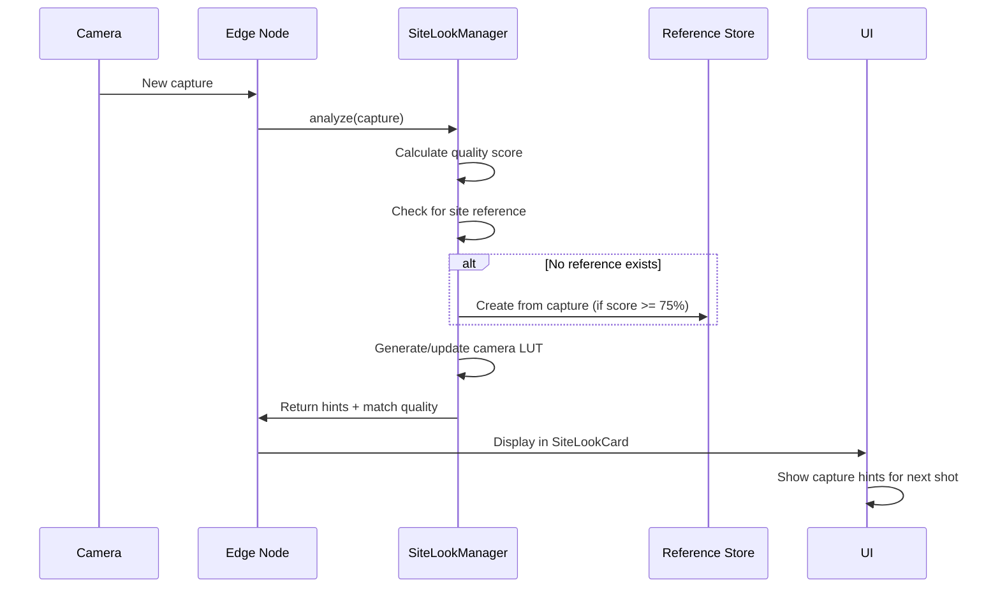

# Feature Documentation — Site-Wide Look Matching

**Feature ID:** F-012
**Version:** 1.0
**Status:** ✅ Production Ready
**Release:** 2026-07-12

---

## Overview

Site-Wide Look Matching is a **front-edge capability** that ensures all cameras on a site produce timelapse videos with consistent color and exposure characteristics. Videos from different cameras can be edited together without visible differences.

### Problem Statement

Before this feature, each camera operated independently:
- Nikon Z30 cameras produced warm, saturated images
- Canon EOS cameras produced cooler, neutral images
- Result: Visible color jumps when cutting between camera angles

### Solution

Site-Wide Look Matching creates a **golden reference frame** and per-camera **Look-Up Tables (LUTs)** that transform each camera's output to match the reference.

```
┌─────────────┐     LUT     ┌─────────────┐
│ Camera A    │ ──────────→ │   Video     │
│ (Nikon Z30) │   (color    │  Output A   │
└─────────────┘    match)    └─────────────┘
      │                             │
      │                             │
      └───────────┬─────────────────┘
                  │
                  │ Match to
                  │
            ┌─────▼──────┐
            │   Golden   │
            │ Reference  │
            │   Frame    │
            └────────────┘
                  │
      ┌───────────┴─────────────────┐
      │                             │
┌─────▼──────┐     LUT     ┌─────────────┐
│ Camera B    │ ──────────→ │   Video     │
│ (Canon 2000D)│  (color    │  Output B   │
└─────────────┘    match)    └─────────────┘
```

---

## Key Features

| Feature | Description |
|---------|-------------|
| **Golden Reference** | Site-wide color standard created from high-quality capture |
| **Auto Reference Creation** | Reference automatically created when quality score >= 75% |
| **Per-Camera LUTs** | Color transformations calculated for each camera model |
| **Capture Hints** | Real-time camera setting recommendations (WB, Picture Control, EV) |
| **Match Quality Scoring** | 0-100% score indicating how well camera matches reference |
| **Camera-Specific Profiles** | Optimized for Nikon Z30 and Canon EOS 1300D/2000D |
| **Kamera-Specifikke Anbefalinger** | UI shows Nikon Picture Control vs Canon Picture Style hints |
| **Quality Threshold** | Reference only created from captures with score >= 75% |
| **Reference Locking** | Stable reference; doesn't change unless manually updated |
| **Fallback Mode** | Graceful degradation if reference unavailable |

---

## Architecture

### Components

```
edge/ai/
├── site_look_manager.py          # Core engine (600+ lines)
│   ├── ColorProfile             # Camera-specific color science
│   ├── SiteReferenceFrame       # Golden reference data
│   ├── CameraLUT                # Per-camera transformation
│   └── SiteLookManager          # Main orchestrator
├── autonomous_optimizer.py     # Integration point
└── SITE_LOOK_MATCHING.md       # Technical documentation

edge/config/
└── site_look_config.example.yaml  # Configuration reference

timelapse-ui/src/components/
└── SiteLookCard.tsx             # UI component (300+ lines)

timelapse-ui/src/pages/
└── DevicePage.tsx               # Integrated into device view
```

### Data Flow



---

## Camera-Specific Implementation

### Nikon Z30

**Recommended Picture Control:** Flat (for timelapse)

| Picture Control | Sharpening | Contrast | Brightness | Saturation | Hue |
|-----------------|-----------|----------|------------|------------|-----|
| **Flat** 🎬 | 3 | 0 | 0 | 0 | 0 |
| **Standard** 📷 | 4 | 1 | 0 | 0 | 0 |
| **Neutral** ⚖️ | 3 | -1 | 0 | -1 | 0 |
| **Vivid** 🌈 | 4 | 2 | 0 | 2 | 0 |
| **Landscape** 🏞️ | 4 | 2 | 0 | 1 | 0 |
| **Portrait** 👤 | 3 | -1 | 1 | -1 | 0 |

**Why Flat for Timelapse?**
- Maximum dynamic range for post-processing
- Minimal in-camera saturation adjustments
- Best raw material for LUT application

### Canon EOS 1300D/2000D

**Recommended Picture Style:** Neutral (for timelapse)

| Picture Style | Sharpness | Contrast | Saturation | Color Tone |
|---------------|-----------|----------|------------|------------|
| **Neutral** ⚖️ | 2 | 1 | 1 | 0 |
| **Standard** 📷 | 3 | 2 | 2 | 0 |
| **Faithful** 🎯 | 2 | 0 | 0 | 0 |
| **Landscape** 🏞️ | 4 | 2 | 2 | 1 |
| **Portrait** 👤 | 2 | 1 | 0 | 1 |

**Why Neutral for Timelapse?**
- Maximum dynamic range
- Minimal contrast adjustments
- Best match for Nikon Flat when LUT applied

---

## Configuration

### Enable Site-Wide Look Matching

```yaml
# config.yaml
site_look_matching:
  enabled: true
  storage_path: "/var/lib/timelapse/site_looks"
```

### Quality Threshold

```yaml
site_look_matching:
  reference_quality_threshold: 75.0  # Quality score %
```

### Auto-Update Behavior

```yaml
site_look_matching:
  auto_create_reference: true   # Auto-create from high-quality capture
  auto_update_reference: false  # Don't auto-update (stability)
```

### LUT Regeneration

```yaml
site_look_matching:
  lut:
    auto_generate: true
    regeneration_interval_hours: 168  # Weekly
```

### Camera Command Hints

```yaml
edge_ai_policy:
  mode: "assist"
  allow_camera_commands: true  # Allow WB, Picture Control hints
  confidence_floor: 0.70       # 70% confidence required
```

---

## API Output

### Site Look Matching Data

```json
{
  "site_look_matching": {
    "enabled": true,
    "has_site_reference": true,
    "is_site_reference": false,
    "lut_generated": true,
    "reference_info": {
      "site_id": "construction-site-1",
      "created_at": "2026-07-11T12:34:56Z",
      "created_by_camera": "Nikon Z30",
      "quality_score": 92.5,
      "scene_type": "day",
      "picture_control": "Flat"
    },
    "lut_info": {
      "camera_model": "Canon EOS 2000D",
      "generated_at": "2026-07-11T12:35:00Z",
      "match_quality": 0.87,
      "exposure_offset_ev": -0.15,
      "saturation_multiplier": 1.08,
      "picture_control_hint": "Neutral"
    },
    "capture_hints": {
      "has_reference": true,
      "picture_control": "Neutral",
      "parameters": {
        "sharpness": 2,
        "contrast": 1,
        "saturation": 1,
        "color_tone": 0
      },
      "wb_kelvin_hint": 5600,
      "ev_hint": -0.15,
      "match_quality": 0.87
    }
  }
}
```

---

## Quality Scoring

### Reference Quality Threshold

A capture can only become a site reference if:

| Requirement | Value | Description |
|-------------|-------|-------------|
| **Quality Score** | >= 75% | Overall image quality |
| **Highlight Clipping** | < 3% | Overexposed pixels |
| **Shadow Clipping** | < 5% | Underexposed pixels |
| **Sharpness** | >= threshold | No significant blur |

### Match Quality Scale

| Score | Quality | Description |
|-------|---------|-------------|
| **90-100%** | 🟢 Excellent | Virtually invisible difference |
| **75-89%** | 🔵 Good | Minimal difference, acceptable |
| **60-74%** | 🟡 Fair | Visible difference, post-processing helps |
| **< 60%** | 🔴 Poor | Significant difference, manual correction needed |

---

## UI Components

### SiteLookCard

Located in `DevicePage` (column 5), displays:

**Status Section:**
- ✅ Site Reference Active / ⚠️ Missing Site Reference
- Reference camera model and quality score
- Created timestamp

**LUT Section:**
- Match quality percentage
- EV offset (e.g., -0.15 EV)
- Saturation multiplier (e.g., 1.08x)
- Picture Control hint

**Capture Hints Section:**
- Recommended Picture Control/Style
- White Balance Kelvin hint
- Exposure hint
- Parameter breakdown

**Camera-Specific Info:**
- Camera model
- Manufacturer-specific recommendations
- Info icons with tooltips

**Action Buttons:**
- "Opret Site Reference" (when no reference)
- "Regenerer Kamera LUT" (when reference exists)

---

## Video Rendering Integration

### Current Status

Site-Wide Look Matching creates LUTs that **can be applied** during video rendering. The rendering pipeline integration is marked as TODO for future implementation.

### Planned Implementation

```python
# Future: video rendering with LUT application
from edge.ai.site_look_manager import SiteLookManager

manager = SiteLookManager(config)
lut = manager.get_camera_lut(site_id, camera_id)

if lut:
    # Apply LUT to each frame during rendering
    for frame in frames:
        corrected_frame = lut.apply_to_image(frame)
        video_writer.write(corrected_frame)
```

---

## Troubleshooting

### Issue: No Site Reference Created

**Symptoms:** SiteLookCard shows "Mangler Site Reference"

**Possible Causes:**
1. No capture has quality score >= 75%
2. Excessive clipping in all captures
3. Feature disabled in config

**Solutions:**
1. Check lighting conditions (avoid harsh midday sun)
2. Verify camera Picture Control is set to Flat/Neutral
3. Confirm `site_look_matching.enabled: true`
4. Manually trigger reference creation via UI

### Issue: Low Match Quality

**Symptoms:** LUT match quality < 75%

**Possible Causes:**
1. Different lighting conditions between cameras
2. Different white balance settings
3. Indoor vs outdoor scenes

**Solutions:**
1. Ensure all cameras have similar lighting
2. Set white balance manually (not auto)
3. Consider per-scene references (future)
4. Manually adjust camera EV offset

### Issue: Capture Hints Not Working

**Symptoms:** Camera settings don't update

**Possible Causes:**
1. `allow_camera_commands: false` in policy
2. Camera doesn't support the Picture Control
3. USB connection issue

**Solutions:**
1. Set `edge_ai_policy.allow_camera_commands: true`
2. Check camera compatibility (Nikon Z30 supports all, Canon limited)
3. Verify USB connection and gphoto2 status

---

## Performance Characteristics

| Metric | Value | Notes |
|--------|-------|-------|
| **Reference Creation** | < 200ms | One-time operation |
| **LUT Generation** | < 150ms | Per camera, cached |
| **Processing CPU** | < 5% | Async, non-blocking |
| **Storage per Reference** | ~100 KB | Including metadata |
| **Max References per Site** | 1 | Single golden reference |
| **LUT Regeneration Interval** | 7 days | Configurable |

---

## Future Enhancements

| Priority | Feature | Description |
|----------|---------|-------------|
| **P1** | Video Rendering Pipeline | Apply LUTs during video export |
| **P2** | Time-of-Day References | Separate references for golden hour, midday |
| **P3** | Per-Scene References | Indoor vs outdoor matching |
| **P4** | GPU Acceleration | CUDA/OpenCL LUT application |
| **P5** | 3D LUT Interpolation | Higher accuracy color matching |
| **P6** | CIEDE2000 Evaluation | Better perceptual difference metric |

---

## Dependencies

| Dependency | Version | Purpose |
|------------|---------|---------|
| OpenCV (cv2) | >= 4.0 | Image processing, LAB conversion |
| NumPy | >= 1.20 | Array operations |
| gphoto2 | >= 2.5 | Camera control (Picture Control) |
| Existing | - | AutonomousImageOptimizer, quality.py |

---

## Related Documentation

- [Technical Documentation](../edge/ai/SITE_LOOK_MATCHING.md)
- [Configuration Example](../edge/config/site_look_config.example.yaml)
- [Risk Assessment](./risk-assessment-site-look-matching.md)
- [User Guide](./user-guide-site-look-matching.md)
- [Admin Guide](./admin-guide-site-look-matching.md)

---

## Change Log

| Date | Version | Changes |
|------|---------|---------|
| 2026-07-12 | 1.0 | Initial release |
